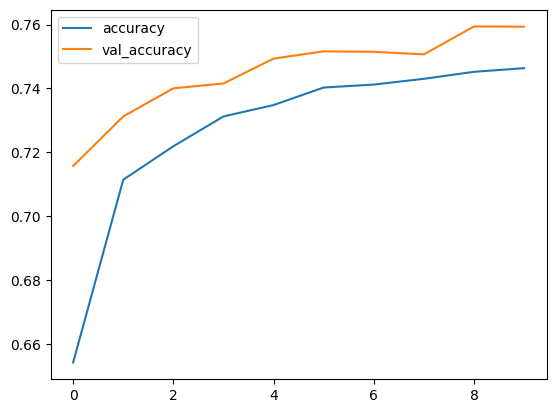

```python
!mkdir -p ~/.kaggle
!cp kaggle.json ~/.kaggle/
```


```python
!kaggle datasets download -d heesoo37/120-years-of-olympic-history-athletes-and-results
```

    Warning: Your Kaggle API key is readable by other users on this system! To fix this, you can run 'chmod 600 /root/.kaggle/kaggle.json'
    120-years-of-olympic-history-athletes-and-results.zip: Skipping, found more recently modified local copy (use --force to force download)
    


```python
import zipfile
zip_ref = zipfile.ZipFile("/content/120-years-of-olympic-history-athletes-and-results.zip","r")
zip_ref.extractall("/content")
zip_ref.close()
```


```python
import pandas as pd
import numpy as np
```


```python
df = pd.read_csv("/content/athlete_events.csv")
```


```python
noc_df = pd.read_csv("/content/noc_regions.csv")
```

Data Wrangling


```python
import random
random.seed(4)
```


```python
df = df.merge(noc_df,on="NOC",how="left")
```


```python
df.tail()
```


  <div id="df-6f22a403-1374-4c4b-89be-82c7d42c01c5">
    <div class="colab-df-container">
      <div>
<style scoped>
    .dataframe tbody tr th:only-of-type {
        vertical-align: middle;
    }

    .dataframe tbody tr th {
        vertical-align: top;
    }

    .dataframe thead th {
        text-align: right;
    }
</style>
<table border="1" class="dataframe">
  <thead>
    <tr style="text-align: right;">
      <th></th>
      <th>ID</th>
      <th>Name</th>
      <th>Sex</th>
      <th>Age</th>
      <th>Height</th>
      <th>Weight</th>
      <th>Team</th>
      <th>NOC</th>
      <th>Games</th>
      <th>Year</th>
      <th>Season</th>
      <th>City</th>
      <th>Sport</th>
      <th>Event</th>
      <th>Medal</th>
      <th>region</th>
      <th>notes</th>
    </tr>
  </thead>
  <tbody>
    <tr>
      <th>271111</th>
      <td>135569</td>
      <td>Andrzej ya</td>
      <td>M</td>
      <td>29.0</td>
      <td>179.0</td>
      <td>89.0</td>
      <td>Poland-1</td>
      <td>POL</td>
      <td>1976 Winter</td>
      <td>1976</td>
      <td>Winter</td>
      <td>Innsbruck</td>
      <td>Luge</td>
      <td>Luge Mixed (Men)'s Doubles</td>
      <td>NaN</td>
      <td>Poland</td>
      <td>NaN</td>
    </tr>
    <tr>
      <th>271112</th>
      <td>135570</td>
      <td>Piotr ya</td>
      <td>M</td>
      <td>27.0</td>
      <td>176.0</td>
      <td>59.0</td>
      <td>Poland</td>
      <td>POL</td>
      <td>2014 Winter</td>
      <td>2014</td>
      <td>Winter</td>
      <td>Sochi</td>
      <td>Ski Jumping</td>
      <td>Ski Jumping Men's Large Hill, Individual</td>
      <td>NaN</td>
      <td>Poland</td>
      <td>NaN</td>
    </tr>
    <tr>
      <th>271113</th>
      <td>135570</td>
      <td>Piotr ya</td>
      <td>M</td>
      <td>27.0</td>
      <td>176.0</td>
      <td>59.0</td>
      <td>Poland</td>
      <td>POL</td>
      <td>2014 Winter</td>
      <td>2014</td>
      <td>Winter</td>
      <td>Sochi</td>
      <td>Ski Jumping</td>
      <td>Ski Jumping Men's Large Hill, Team</td>
      <td>NaN</td>
      <td>Poland</td>
      <td>NaN</td>
    </tr>
    <tr>
      <th>271114</th>
      <td>135571</td>
      <td>Tomasz Ireneusz ya</td>
      <td>M</td>
      <td>30.0</td>
      <td>185.0</td>
      <td>96.0</td>
      <td>Poland</td>
      <td>POL</td>
      <td>1998 Winter</td>
      <td>1998</td>
      <td>Winter</td>
      <td>Nagano</td>
      <td>Bobsleigh</td>
      <td>Bobsleigh Men's Four</td>
      <td>NaN</td>
      <td>Poland</td>
      <td>NaN</td>
    </tr>
    <tr>
      <th>271115</th>
      <td>135571</td>
      <td>Tomasz Ireneusz ya</td>
      <td>M</td>
      <td>34.0</td>
      <td>185.0</td>
      <td>96.0</td>
      <td>Poland</td>
      <td>POL</td>
      <td>2002 Winter</td>
      <td>2002</td>
      <td>Winter</td>
      <td>Salt Lake City</td>
      <td>Bobsleigh</td>
      <td>Bobsleigh Men's Four</td>
      <td>NaN</td>
      <td>Poland</td>
      <td>NaN</td>
    </tr>
  </tbody>
</table>
</div>
      <button class="colab-df-convert" onclick="convertToInteractive('df-6f22a403-1374-4c4b-89be-82c7d42c01c5')"
              title="Convert this dataframe to an interactive table."
              style="display:none;">

  <svg xmlns="http://www.w3.org/2000/svg" height="24px"viewBox="0 0 24 24"
       width="24px">
    <path d="M0 0h24v24H0V0z" fill="none"/>
    <path d="M18.56 5.44l.94 2.06.94-2.06 2.06-.94-2.06-.94-.94-2.06-.94 2.06-2.06.94zm-11 1L8.5 8.5l.94-2.06 2.06-.94-2.06-.94L8.5 2.5l-.94 2.06-2.06.94zm10 10l.94 2.06.94-2.06 2.06-.94-2.06-.94-.94-2.06-.94 2.06-2.06.94z"/><path d="M17.41 7.96l-1.37-1.37c-.4-.4-.92-.59-1.43-.59-.52 0-1.04.2-1.43.59L10.3 9.45l-7.72 7.72c-.78.78-.78 2.05 0 2.83L4 21.41c.39.39.9.59 1.41.59.51 0 1.02-.2 1.41-.59l7.78-7.78 2.81-2.81c.8-.78.8-2.07 0-2.86zM5.41 20L4 18.59l7.72-7.72 1.47 1.35L5.41 20z"/>
  </svg>
      </button>


    <div id="df-f63a3c6a-0746-4072-bda5-c0f985543990">
      <button class="colab-df-quickchart" onclick="quickchart('df-f63a3c6a-0746-4072-bda5-c0f985543990')"
              title="Suggest charts."
              style="display:none;">

<svg xmlns="http://www.w3.org/2000/svg" height="24px"viewBox="0 0 24 24"
     width="24px">
    <g>
        <path d="M19 3H5c-1.1 0-2 .9-2 2v14c0 1.1.9 2 2 2h14c1.1 0 2-.9 2-2V5c0-1.1-.9-2-2-2zM9 17H7v-7h2v7zm4 0h-2V7h2v10zm4 0h-2v-4h2v4z"/>
    </g>
</svg>
      </button>
    </div>

<style>
  .colab-df-quickchart {
    background-color: #E8F0FE;
    border: none;
    border-radius: 50%;
    cursor: pointer;
    display: none;
    fill: #1967D2;
    height: 32px;
    padding: 0 0 0 0;
    width: 32px;
  }

  .colab-df-quickchart:hover {
    background-color: #E2EBFA;
    box-shadow: 0px 1px 2px rgba(60, 64, 67, 0.3), 0px 1px 3px 1px rgba(60, 64, 67, 0.15);
    fill: #174EA6;
  }

  [theme=dark] .colab-df-quickchart {
    background-color: #3B4455;
    fill: #D2E3FC;
  }

  [theme=dark] .colab-df-quickchart:hover {
    background-color: #434B5C;
    box-shadow: 0px 1px 3px 1px rgba(0, 0, 0, 0.15);
    filter: drop-shadow(0px 1px 2px rgba(0, 0, 0, 0.3));
    fill: #FFFFFF;
  }
</style>

    <script>
      async function quickchart(key) {
        const containerElement = document.querySelector('#' + key);
        const charts = await google.colab.kernel.invokeFunction(
            'suggestCharts', [key], {});
      }
    </script>

      <script>

function displayQuickchartButton(domScope) {
  let quickchartButtonEl =
    domScope.querySelector('#df-f63a3c6a-0746-4072-bda5-c0f985543990 button.colab-df-quickchart');
  quickchartButtonEl.style.display =
    google.colab.kernel.accessAllowed ? 'block' : 'none';
}

        displayQuickchartButton(document);
      </script>
      <style>
    .colab-df-container {
      display:flex;
      flex-wrap:wrap;
      gap: 12px;
    }

    .colab-df-convert {
      background-color: #E8F0FE;
      border: none;
      border-radius: 50%;
      cursor: pointer;
      display: none;
      fill: #1967D2;
      height: 32px;
      padding: 0 0 0 0;
      width: 32px;
    }

    .colab-df-convert:hover {
      background-color: #E2EBFA;
      box-shadow: 0px 1px 2px rgba(60, 64, 67, 0.3), 0px 1px 3px 1px rgba(60, 64, 67, 0.15);
      fill: #174EA6;
    }

    [theme=dark] .colab-df-convert {
      background-color: #3B4455;
      fill: #D2E3FC;
    }

    [theme=dark] .colab-df-convert:hover {
      background-color: #434B5C;
      box-shadow: 0px 1px 3px 1px rgba(0, 0, 0, 0.15);
      filter: drop-shadow(0px 1px 2px rgba(0, 0, 0, 0.3));
      fill: #FFFFFF;
    }
  </style>

      <script>
        const buttonEl =
          document.querySelector('#df-6f22a403-1374-4c4b-89be-82c7d42c01c5 button.colab-df-convert');
        buttonEl.style.display =
          google.colab.kernel.accessAllowed ? 'block' : 'none';

        async function convertToInteractive(key) {
          const element = document.querySelector('#df-6f22a403-1374-4c4b-89be-82c7d42c01c5');
          const dataTable =
            await google.colab.kernel.invokeFunction('convertToInteractive',
                                                     [key], {});
          if (!dataTable) return;

          const docLinkHtml = 'Like what you see? Visit the ' +
            '<a target="_blank" href=https://colab.research.google.com/notebooks/data_table.ipynb>data table notebook</a>'
            + ' to learn more about interactive tables.';
          element.innerHTML = '';
          dataTable['output_type'] = 'display_data';
          await google.colab.output.renderOutput(dataTable, element);
          const docLink = document.createElement('div');
          docLink.innerHTML = docLinkHtml;
          element.appendChild(docLink);
        }
      </script>
    </div>
  </div>


```python
df.shape
```


    (271116, 17)


```python
selected_col = ["Sex" , "Age" , "Height" , "Weight" , "region" ,"Sport","Medal"]
```


```python
df_temp = df[selected_col]
```


```python
df_temp
```


  <div id="df-ee92f363-4173-4fac-a46c-cdaa41020c13">
    <div class="colab-df-container">
      <div>
<style scoped>
    .dataframe tbody tr th:only-of-type {
        vertical-align: middle;
    }

    .dataframe tbody tr th {
        vertical-align: top;
    }

    .dataframe thead th {
        text-align: right;
    }
</style>
<table border="1" class="dataframe">
  <thead>
    <tr style="text-align: right;">
      <th></th>
      <th>Sex</th>
      <th>Age</th>
      <th>Height</th>
      <th>Weight</th>
      <th>region</th>
      <th>Sport</th>
      <th>Medal</th>
    </tr>
  </thead>
  <tbody>
    <tr>
      <th>0</th>
      <td>M</td>
      <td>24.0</td>
      <td>180.0</td>
      <td>80.0</td>
      <td>China</td>
      <td>Basketball</td>
      <td>NaN</td>
    </tr>
    <tr>
      <th>1</th>
      <td>M</td>
      <td>23.0</td>
      <td>170.0</td>
      <td>60.0</td>
      <td>China</td>
      <td>Judo</td>
      <td>NaN</td>
    </tr>
    <tr>
      <th>2</th>
      <td>M</td>
      <td>24.0</td>
      <td>NaN</td>
      <td>NaN</td>
      <td>Denmark</td>
      <td>Football</td>
      <td>NaN</td>
    </tr>
    <tr>
      <th>3</th>
      <td>M</td>
      <td>34.0</td>
      <td>NaN</td>
      <td>NaN</td>
      <td>Denmark</td>
      <td>Tug-Of-War</td>
      <td>Gold</td>
    </tr>
    <tr>
      <th>4</th>
      <td>F</td>
      <td>21.0</td>
      <td>185.0</td>
      <td>82.0</td>
      <td>Netherlands</td>
      <td>Speed Skating</td>
      <td>NaN</td>
    </tr>
    <tr>
      <th>...</th>
      <td>...</td>
      <td>...</td>
      <td>...</td>
      <td>...</td>
      <td>...</td>
      <td>...</td>
      <td>...</td>
    </tr>
    <tr>
      <th>271111</th>
      <td>M</td>
      <td>29.0</td>
      <td>179.0</td>
      <td>89.0</td>
      <td>Poland</td>
      <td>Luge</td>
      <td>NaN</td>
    </tr>
    <tr>
      <th>271112</th>
      <td>M</td>
      <td>27.0</td>
      <td>176.0</td>
      <td>59.0</td>
      <td>Poland</td>
      <td>Ski Jumping</td>
      <td>NaN</td>
    </tr>
    <tr>
      <th>271113</th>
      <td>M</td>
      <td>27.0</td>
      <td>176.0</td>
      <td>59.0</td>
      <td>Poland</td>
      <td>Ski Jumping</td>
      <td>NaN</td>
    </tr>
    <tr>
      <th>271114</th>
      <td>M</td>
      <td>30.0</td>
      <td>185.0</td>
      <td>96.0</td>
      <td>Poland</td>
      <td>Bobsleigh</td>
      <td>NaN</td>
    </tr>
    <tr>
      <th>271115</th>
      <td>M</td>
      <td>34.0</td>
      <td>185.0</td>
      <td>96.0</td>
      <td>Poland</td>
      <td>Bobsleigh</td>
      <td>NaN</td>
    </tr>
  </tbody>
</table>
<p>271116 rows × 7 columns</p>
</div>
      <button class="colab-df-convert" onclick="convertToInteractive('df-ee92f363-4173-4fac-a46c-cdaa41020c13')"
              title="Convert this dataframe to an interactive table."
              style="display:none;">

  <svg xmlns="http://www.w3.org/2000/svg" height="24px"viewBox="0 0 24 24"
       width="24px">
    <path d="M0 0h24v24H0V0z" fill="none"/>
    <path d="M18.56 5.44l.94 2.06.94-2.06 2.06-.94-2.06-.94-.94-2.06-.94 2.06-2.06.94zm-11 1L8.5 8.5l.94-2.06 2.06-.94-2.06-.94L8.5 2.5l-.94 2.06-2.06.94zm10 10l.94 2.06.94-2.06 2.06-.94-2.06-.94-.94-2.06-.94 2.06-2.06.94z"/><path d="M17.41 7.96l-1.37-1.37c-.4-.4-.92-.59-1.43-.59-.52 0-1.04.2-1.43.59L10.3 9.45l-7.72 7.72c-.78.78-.78 2.05 0 2.83L4 21.41c.39.39.9.59 1.41.59.51 0 1.02-.2 1.41-.59l7.78-7.78 2.81-2.81c.8-.78.8-2.07 0-2.86zM5.41 20L4 18.59l7.72-7.72 1.47 1.35L5.41 20z"/>
  </svg>
      </button>


    <div id="df-3b697dbe-c078-4d55-a7f6-c6aa19a75934">
      <button class="colab-df-quickchart" onclick="quickchart('df-3b697dbe-c078-4d55-a7f6-c6aa19a75934')"
              title="Suggest charts."
              style="display:none;">

<svg xmlns="http://www.w3.org/2000/svg" height="24px"viewBox="0 0 24 24"
     width="24px">
    <g>
        <path d="M19 3H5c-1.1 0-2 .9-2 2v14c0 1.1.9 2 2 2h14c1.1 0 2-.9 2-2V5c0-1.1-.9-2-2-2zM9 17H7v-7h2v7zm4 0h-2V7h2v10zm4 0h-2v-4h2v4z"/>
    </g>
</svg>
      </button>
    </div>

<style>
  .colab-df-quickchart {
    background-color: #E8F0FE;
    border: none;
    border-radius: 50%;
    cursor: pointer;
    display: none;
    fill: #1967D2;
    height: 32px;
    padding: 0 0 0 0;
    width: 32px;
  }

  .colab-df-quickchart:hover {
    background-color: #E2EBFA;
    box-shadow: 0px 1px 2px rgba(60, 64, 67, 0.3), 0px 1px 3px 1px rgba(60, 64, 67, 0.15);
    fill: #174EA6;
  }

  [theme=dark] .colab-df-quickchart {
    background-color: #3B4455;
    fill: #D2E3FC;
  }

  [theme=dark] .colab-df-quickchart:hover {
    background-color: #434B5C;
    box-shadow: 0px 1px 3px 1px rgba(0, 0, 0, 0.15);
    filter: drop-shadow(0px 1px 2px rgba(0, 0, 0, 0.3));
    fill: #FFFFFF;
  }
</style>

    <script>
      async function quickchart(key) {
        const containerElement = document.querySelector('#' + key);
        const charts = await google.colab.kernel.invokeFunction(
            'suggestCharts', [key], {});
      }
    </script>

      <script>

function displayQuickchartButton(domScope) {
  let quickchartButtonEl =
    domScope.querySelector('#df-3b697dbe-c078-4d55-a7f6-c6aa19a75934 button.colab-df-quickchart');
  quickchartButtonEl.style.display =
    google.colab.kernel.accessAllowed ? 'block' : 'none';
}

        displayQuickchartButton(document);
      </script>
      <style>
    .colab-df-container {
      display:flex;
      flex-wrap:wrap;
      gap: 12px;
    }

    .colab-df-convert {
      background-color: #E8F0FE;
      border: none;
      border-radius: 50%;
      cursor: pointer;
      display: none;
      fill: #1967D2;
      height: 32px;
      padding: 0 0 0 0;
      width: 32px;
    }

    .colab-df-convert:hover {
      background-color: #E2EBFA;
      box-shadow: 0px 1px 2px rgba(60, 64, 67, 0.3), 0px 1px 3px 1px rgba(60, 64, 67, 0.15);
      fill: #174EA6;
    }

    [theme=dark] .colab-df-convert {
      background-color: #3B4455;
      fill: #D2E3FC;
    }

    [theme=dark] .colab-df-convert:hover {
      background-color: #434B5C;
      box-shadow: 0px 1px 3px 1px rgba(0, 0, 0, 0.15);
      filter: drop-shadow(0px 1px 2px rgba(0, 0, 0, 0.3));
      fill: #FFFFFF;
    }
  </style>

      <script>
        const buttonEl =
          document.querySelector('#df-ee92f363-4173-4fac-a46c-cdaa41020c13 button.colab-df-convert');
        buttonEl.style.display =
          google.colab.kernel.accessAllowed ? 'block' : 'none';

        async function convertToInteractive(key) {
          const element = document.querySelector('#df-ee92f363-4173-4fac-a46c-cdaa41020c13');
          const dataTable =
            await google.colab.kernel.invokeFunction('convertToInteractive',
                                                     [key], {});
          if (!dataTable) return;

          const docLinkHtml = 'Like what you see? Visit the ' +
            '<a target="_blank" href=https://colab.research.google.com/notebooks/data_table.ipynb>data table notebook</a>'
            + ' to learn more about interactive tables.';
          element.innerHTML = '';
          dataTable['output_type'] = 'display_data';
          await google.colab.output.renderOutput(dataTable, element);
          const docLink = document.createElement('div');
          docLink.innerHTML = docLinkHtml;
          element.appendChild(docLink);
        }
      </script>
    </div>
  </div>


```python
df_temp["ID"] = np.arange(0,271116)
```

    <ipython-input-14-6a32e352b6be>:1: SettingWithCopyWarning: 
    A value is trying to be set on a copy of a slice from a DataFrame.
    Try using .loc[row_indexer,col_indexer] = value instead
    
    See the caveats in the documentation: https://pandas.pydata.org/pandas-docs/stable/user_guide/indexing.html#returning-a-view-versus-a-copy
      df_temp["ID"] = np.arange(0,271116)
    


```python
df_temp
```


  <div id="df-a5b986a6-8d45-4420-b558-7832699d1792">
    <div class="colab-df-container">
      <div>
<style scoped>
    .dataframe tbody tr th:only-of-type {
        vertical-align: middle;
    }

    .dataframe tbody tr th {
        vertical-align: top;
    }

    .dataframe thead th {
        text-align: right;
    }
</style>
<table border="1" class="dataframe">
  <thead>
    <tr style="text-align: right;">
      <th></th>
      <th>Sex</th>
      <th>Age</th>
      <th>Height</th>
      <th>Weight</th>
      <th>region</th>
      <th>Sport</th>
      <th>Medal</th>
      <th>ID</th>
    </tr>
  </thead>
  <tbody>
    <tr>
      <th>0</th>
      <td>M</td>
      <td>24.0</td>
      <td>180.0</td>
      <td>80.0</td>
      <td>China</td>
      <td>Basketball</td>
      <td>NaN</td>
      <td>0</td>
    </tr>
    <tr>
      <th>1</th>
      <td>M</td>
      <td>23.0</td>
      <td>170.0</td>
      <td>60.0</td>
      <td>China</td>
      <td>Judo</td>
      <td>NaN</td>
      <td>1</td>
    </tr>
    <tr>
      <th>2</th>
      <td>M</td>
      <td>24.0</td>
      <td>NaN</td>
      <td>NaN</td>
      <td>Denmark</td>
      <td>Football</td>
      <td>NaN</td>
      <td>2</td>
    </tr>
    <tr>
      <th>3</th>
      <td>M</td>
      <td>34.0</td>
      <td>NaN</td>
      <td>NaN</td>
      <td>Denmark</td>
      <td>Tug-Of-War</td>
      <td>Gold</td>
      <td>3</td>
    </tr>
    <tr>
      <th>4</th>
      <td>F</td>
      <td>21.0</td>
      <td>185.0</td>
      <td>82.0</td>
      <td>Netherlands</td>
      <td>Speed Skating</td>
      <td>NaN</td>
      <td>4</td>
    </tr>
    <tr>
      <th>...</th>
      <td>...</td>
      <td>...</td>
      <td>...</td>
      <td>...</td>
      <td>...</td>
      <td>...</td>
      <td>...</td>
      <td>...</td>
    </tr>
    <tr>
      <th>271111</th>
      <td>M</td>
      <td>29.0</td>
      <td>179.0</td>
      <td>89.0</td>
      <td>Poland</td>
      <td>Luge</td>
      <td>NaN</td>
      <td>271111</td>
    </tr>
    <tr>
      <th>271112</th>
      <td>M</td>
      <td>27.0</td>
      <td>176.0</td>
      <td>59.0</td>
      <td>Poland</td>
      <td>Ski Jumping</td>
      <td>NaN</td>
      <td>271112</td>
    </tr>
    <tr>
      <th>271113</th>
      <td>M</td>
      <td>27.0</td>
      <td>176.0</td>
      <td>59.0</td>
      <td>Poland</td>
      <td>Ski Jumping</td>
      <td>NaN</td>
      <td>271113</td>
    </tr>
    <tr>
      <th>271114</th>
      <td>M</td>
      <td>30.0</td>
      <td>185.0</td>
      <td>96.0</td>
      <td>Poland</td>
      <td>Bobsleigh</td>
      <td>NaN</td>
      <td>271114</td>
    </tr>
    <tr>
      <th>271115</th>
      <td>M</td>
      <td>34.0</td>
      <td>185.0</td>
      <td>96.0</td>
      <td>Poland</td>
      <td>Bobsleigh</td>
      <td>NaN</td>
      <td>271115</td>
    </tr>
  </tbody>
</table>
<p>271116 rows × 8 columns</p>
</div>
      <button class="colab-df-convert" onclick="convertToInteractive('df-a5b986a6-8d45-4420-b558-7832699d1792')"
              title="Convert this dataframe to an interactive table."
              style="display:none;">

  <svg xmlns="http://www.w3.org/2000/svg" height="24px"viewBox="0 0 24 24"
       width="24px">
    <path d="M0 0h24v24H0V0z" fill="none"/>
    <path d="M18.56 5.44l.94 2.06.94-2.06 2.06-.94-2.06-.94-.94-2.06-.94 2.06-2.06.94zm-11 1L8.5 8.5l.94-2.06 2.06-.94-2.06-.94L8.5 2.5l-.94 2.06-2.06.94zm10 10l.94 2.06.94-2.06 2.06-.94-2.06-.94-.94-2.06-.94 2.06-2.06.94z"/><path d="M17.41 7.96l-1.37-1.37c-.4-.4-.92-.59-1.43-.59-.52 0-1.04.2-1.43.59L10.3 9.45l-7.72 7.72c-.78.78-.78 2.05 0 2.83L4 21.41c.39.39.9.59 1.41.59.51 0 1.02-.2 1.41-.59l7.78-7.78 2.81-2.81c.8-.78.8-2.07 0-2.86zM5.41 20L4 18.59l7.72-7.72 1.47 1.35L5.41 20z"/>
  </svg>
      </button>


    <div id="df-30f27301-2feb-4889-89de-62c4dbc1e920">
      <button class="colab-df-quickchart" onclick="quickchart('df-30f27301-2feb-4889-89de-62c4dbc1e920')"
              title="Suggest charts."
              style="display:none;">

<svg xmlns="http://www.w3.org/2000/svg" height="24px"viewBox="0 0 24 24"
     width="24px">
    <g>
        <path d="M19 3H5c-1.1 0-2 .9-2 2v14c0 1.1.9 2 2 2h14c1.1 0 2-.9 2-2V5c0-1.1-.9-2-2-2zM9 17H7v-7h2v7zm4 0h-2V7h2v10zm4 0h-2v-4h2v4z"/>
    </g>
</svg>
      </button>
    </div>

<style>
  .colab-df-quickchart {
    background-color: #E8F0FE;
    border: none;
    border-radius: 50%;
    cursor: pointer;
    display: none;
    fill: #1967D2;
    height: 32px;
    padding: 0 0 0 0;
    width: 32px;
  }

  .colab-df-quickchart:hover {
    background-color: #E2EBFA;
    box-shadow: 0px 1px 2px rgba(60, 64, 67, 0.3), 0px 1px 3px 1px rgba(60, 64, 67, 0.15);
    fill: #174EA6;
  }

  [theme=dark] .colab-df-quickchart {
    background-color: #3B4455;
    fill: #D2E3FC;
  }

  [theme=dark] .colab-df-quickchart:hover {
    background-color: #434B5C;
    box-shadow: 0px 1px 3px 1px rgba(0, 0, 0, 0.15);
    filter: drop-shadow(0px 1px 2px rgba(0, 0, 0, 0.3));
    fill: #FFFFFF;
  }
</style>

    <script>
      async function quickchart(key) {
        const containerElement = document.querySelector('#' + key);
        const charts = await google.colab.kernel.invokeFunction(
            'suggestCharts', [key], {});
      }
    </script>

      <script>

function displayQuickchartButton(domScope) {
  let quickchartButtonEl =
    domScope.querySelector('#df-30f27301-2feb-4889-89de-62c4dbc1e920 button.colab-df-quickchart');
  quickchartButtonEl.style.display =
    google.colab.kernel.accessAllowed ? 'block' : 'none';
}

        displayQuickchartButton(document);
      </script>
      <style>
    .colab-df-container {
      display:flex;
      flex-wrap:wrap;
      gap: 12px;
    }

    .colab-df-convert {
      background-color: #E8F0FE;
      border: none;
      border-radius: 50%;
      cursor: pointer;
      display: none;
      fill: #1967D2;
      height: 32px;
      padding: 0 0 0 0;
      width: 32px;
    }

    .colab-df-convert:hover {
      background-color: #E2EBFA;
      box-shadow: 0px 1px 2px rgba(60, 64, 67, 0.3), 0px 1px 3px 1px rgba(60, 64, 67, 0.15);
      fill: #174EA6;
    }

    [theme=dark] .colab-df-convert {
      background-color: #3B4455;
      fill: #D2E3FC;
    }

    [theme=dark] .colab-df-convert:hover {
      background-color: #434B5C;
      box-shadow: 0px 1px 3px 1px rgba(0, 0, 0, 0.15);
      filter: drop-shadow(0px 1px 2px rgba(0, 0, 0, 0.3));
      fill: #FFFFFF;
    }
  </style>

      <script>
        const buttonEl =
          document.querySelector('#df-a5b986a6-8d45-4420-b558-7832699d1792 button.colab-df-convert');
        buttonEl.style.display =
          google.colab.kernel.accessAllowed ? 'block' : 'none';

        async function convertToInteractive(key) {
          const element = document.querySelector('#df-a5b986a6-8d45-4420-b558-7832699d1792');
          const dataTable =
            await google.colab.kernel.invokeFunction('convertToInteractive',
                                                     [key], {});
          if (!dataTable) return;

          const docLinkHtml = 'Like what you see? Visit the ' +
            '<a target="_blank" href=https://colab.research.google.com/notebooks/data_table.ipynb>data table notebook</a>'
            + ' to learn more about interactive tables.';
          element.innerHTML = '';
          dataTable['output_type'] = 'display_data';
          await google.colab.output.renderOutput(dataTable, element);
          const docLink = document.createElement('div');
          docLink.innerHTML = docLinkHtml;
          element.appendChild(docLink);
        }
      </script>
    </div>
  </div>


```python
dict ={
    np.nan:0,
    "Gold":1,
    "Silver":1,
    "Bronze":1
}
```


```python
df_temp["Medal"] = df_temp["Medal"].replace(dict)
```

    <ipython-input-17-3fed600d219d>:1: SettingWithCopyWarning: 
    A value is trying to be set on a copy of a slice from a DataFrame.
    Try using .loc[row_indexer,col_indexer] = value instead
    
    See the caveats in the documentation: https://pandas.pydata.org/pandas-docs/stable/user_guide/indexing.html#returning-a-view-versus-a-copy
      df_temp["Medal"] = df_temp["Medal"].replace(dict)
    


```python
df_temp.head()
```


  <div id="df-801e7890-fd9d-4ec0-b75c-09f8fb6a7123">
    <div class="colab-df-container">
      <div>
<style scoped>
    .dataframe tbody tr th:only-of-type {
        vertical-align: middle;
    }

    .dataframe tbody tr th {
        vertical-align: top;
    }

    .dataframe thead th {
        text-align: right;
    }
</style>
<table border="1" class="dataframe">
  <thead>
    <tr style="text-align: right;">
      <th></th>
      <th>Sex</th>
      <th>Age</th>
      <th>Height</th>
      <th>Weight</th>
      <th>region</th>
      <th>Sport</th>
      <th>Medal</th>
      <th>ID</th>
    </tr>
  </thead>
  <tbody>
    <tr>
      <th>0</th>
      <td>M</td>
      <td>24.0</td>
      <td>180.0</td>
      <td>80.0</td>
      <td>China</td>
      <td>Basketball</td>
      <td>0</td>
      <td>0</td>
    </tr>
    <tr>
      <th>1</th>
      <td>M</td>
      <td>23.0</td>
      <td>170.0</td>
      <td>60.0</td>
      <td>China</td>
      <td>Judo</td>
      <td>0</td>
      <td>1</td>
    </tr>
    <tr>
      <th>2</th>
      <td>M</td>
      <td>24.0</td>
      <td>NaN</td>
      <td>NaN</td>
      <td>Denmark</td>
      <td>Football</td>
      <td>0</td>
      <td>2</td>
    </tr>
    <tr>
      <th>3</th>
      <td>M</td>
      <td>34.0</td>
      <td>NaN</td>
      <td>NaN</td>
      <td>Denmark</td>
      <td>Tug-Of-War</td>
      <td>1</td>
      <td>3</td>
    </tr>
    <tr>
      <th>4</th>
      <td>F</td>
      <td>21.0</td>
      <td>185.0</td>
      <td>82.0</td>
      <td>Netherlands</td>
      <td>Speed Skating</td>
      <td>0</td>
      <td>4</td>
    </tr>
  </tbody>
</table>
</div>
      <button class="colab-df-convert" onclick="convertToInteractive('df-801e7890-fd9d-4ec0-b75c-09f8fb6a7123')"
              title="Convert this dataframe to an interactive table."
              style="display:none;">

  <svg xmlns="http://www.w3.org/2000/svg" height="24px"viewBox="0 0 24 24"
       width="24px">
    <path d="M0 0h24v24H0V0z" fill="none"/>
    <path d="M18.56 5.44l.94 2.06.94-2.06 2.06-.94-2.06-.94-.94-2.06-.94 2.06-2.06.94zm-11 1L8.5 8.5l.94-2.06 2.06-.94-2.06-.94L8.5 2.5l-.94 2.06-2.06.94zm10 10l.94 2.06.94-2.06 2.06-.94-2.06-.94-.94-2.06-.94 2.06-2.06.94z"/><path d="M17.41 7.96l-1.37-1.37c-.4-.4-.92-.59-1.43-.59-.52 0-1.04.2-1.43.59L10.3 9.45l-7.72 7.72c-.78.78-.78 2.05 0 2.83L4 21.41c.39.39.9.59 1.41.59.51 0 1.02-.2 1.41-.59l7.78-7.78 2.81-2.81c.8-.78.8-2.07 0-2.86zM5.41 20L4 18.59l7.72-7.72 1.47 1.35L5.41 20z"/>
  </svg>
      </button>


    <div id="df-841b3513-b69c-4888-99e7-77a436dd977a">
      <button class="colab-df-quickchart" onclick="quickchart('df-841b3513-b69c-4888-99e7-77a436dd977a')"
              title="Suggest charts."
              style="display:none;">

<svg xmlns="http://www.w3.org/2000/svg" height="24px"viewBox="0 0 24 24"
     width="24px">
    <g>
        <path d="M19 3H5c-1.1 0-2 .9-2 2v14c0 1.1.9 2 2 2h14c1.1 0 2-.9 2-2V5c0-1.1-.9-2-2-2zM9 17H7v-7h2v7zm4 0h-2V7h2v10zm4 0h-2v-4h2v4z"/>
    </g>
</svg>
      </button>
    </div>

<style>
  .colab-df-quickchart {
    background-color: #E8F0FE;
    border: none;
    border-radius: 50%;
    cursor: pointer;
    display: none;
    fill: #1967D2;
    height: 32px;
    padding: 0 0 0 0;
    width: 32px;
  }

  .colab-df-quickchart:hover {
    background-color: #E2EBFA;
    box-shadow: 0px 1px 2px rgba(60, 64, 67, 0.3), 0px 1px 3px 1px rgba(60, 64, 67, 0.15);
    fill: #174EA6;
  }

  [theme=dark] .colab-df-quickchart {
    background-color: #3B4455;
    fill: #D2E3FC;
  }

  [theme=dark] .colab-df-quickchart:hover {
    background-color: #434B5C;
    box-shadow: 0px 1px 3px 1px rgba(0, 0, 0, 0.15);
    filter: drop-shadow(0px 1px 2px rgba(0, 0, 0, 0.3));
    fill: #FFFFFF;
  }
</style>

    <script>
      async function quickchart(key) {
        const containerElement = document.querySelector('#' + key);
        const charts = await google.colab.kernel.invokeFunction(
            'suggestCharts', [key], {});
      }
    </script>

      <script>

function displayQuickchartButton(domScope) {
  let quickchartButtonEl =
    domScope.querySelector('#df-841b3513-b69c-4888-99e7-77a436dd977a button.colab-df-quickchart');
  quickchartButtonEl.style.display =
    google.colab.kernel.accessAllowed ? 'block' : 'none';
}

        displayQuickchartButton(document);
      </script>
      <style>
    .colab-df-container {
      display:flex;
      flex-wrap:wrap;
      gap: 12px;
    }

    .colab-df-convert {
      background-color: #E8F0FE;
      border: none;
      border-radius: 50%;
      cursor: pointer;
      display: none;
      fill: #1967D2;
      height: 32px;
      padding: 0 0 0 0;
      width: 32px;
    }

    .colab-df-convert:hover {
      background-color: #E2EBFA;
      box-shadow: 0px 1px 2px rgba(60, 64, 67, 0.3), 0px 1px 3px 1px rgba(60, 64, 67, 0.15);
      fill: #174EA6;
    }

    [theme=dark] .colab-df-convert {
      background-color: #3B4455;
      fill: #D2E3FC;
    }

    [theme=dark] .colab-df-convert:hover {
      background-color: #434B5C;
      box-shadow: 0px 1px 3px 1px rgba(0, 0, 0, 0.15);
      filter: drop-shadow(0px 1px 2px rgba(0, 0, 0, 0.3));
      fill: #FFFFFF;
    }
  </style>

      <script>
        const buttonEl =
          document.querySelector('#df-801e7890-fd9d-4ec0-b75c-09f8fb6a7123 button.colab-df-convert');
        buttonEl.style.display =
          google.colab.kernel.accessAllowed ? 'block' : 'none';

        async function convertToInteractive(key) {
          const element = document.querySelector('#df-801e7890-fd9d-4ec0-b75c-09f8fb6a7123');
          const dataTable =
            await google.colab.kernel.invokeFunction('convertToInteractive',
                                                     [key], {});
          if (!dataTable) return;

          const docLinkHtml = 'Like what you see? Visit the ' +
            '<a target="_blank" href=https://colab.research.google.com/notebooks/data_table.ipynb>data table notebook</a>'
            + ' to learn more about interactive tables.';
          element.innerHTML = '';
          dataTable['output_type'] = 'display_data';
          await google.colab.output.renderOutput(dataTable, element);
          const docLink = document.createElement('div');
          docLink.innerHTML = docLinkHtml;
          element.appendChild(docLink);
        }
      </script>
    </div>
  </div>


```python
medal = df_temp[df_temp["Medal"] == 1].shape[0]
no_medal = df_temp[df_temp["Medal"] == 0].shape[0]
```


```python
medal , no_medal , medal+no_medal, df_temp.shape[0]
```


    (39783, 231333, 271116, 271116)


```python
medal_df = df_temp[df_temp["Medal"] == 1]
no_medal_df = df_temp[df_temp["Medal"] == 0].head(39783)
```


```python
df_temp = pd.concat([medal_df,no_medal_df],axis=0)
```


```python
df_temp.shape[0]/2
```


    39783.0


```python
df_temp.isnull().mean()
```


    Sex       0.000000
    Age       0.029447
    Height    0.222092
    Weight    0.234736
    region    0.000729
    Sport     0.000000
    Medal     0.000000
    ID        0.000000
    dtype: float64


```python
df_temp.shape
```


    (79566, 8)


Imputation


```python
avg_male_height = df_temp[df_temp["Sex"] == "M"]["Height"].mean()
avg_female_height = df_temp[df_temp["Sex"] == "F"]["Height"].mean()
avg_male_weight = df_temp[df_temp["Sex"] == "M"]["Weight"].mean()
avg_female_weight = df_temp[df_temp["Sex"] == "F"]["Weight"].mean()
avg_male_age = df_temp[df_temp["Sex"] == "M"]["Age"].mean()
avg_female_age = df_temp[df_temp["Sex"] == "F"]["Age"].mean()
```

For Height


```python
temp = df_temp[["ID","Sex","Height"]]
temp_male = temp[temp["Sex"] == "M" ]
temp_female = temp[temp["Sex"] == "F" ]
temp_male["Height"].fillna(avg_male_height,inplace=True)
temp_female["Height"].fillna(avg_female_height,inplace=True)
temp_male.shape[0]+temp_female.shape[0]
temp = pd.concat([temp_male,temp_female],axis=0)
temp.drop("Sex",axis=1,inplace=True)
df_temp.drop("Height",axis=1,inplace=True)
df_temp = df_temp.merge(temp,on="ID",how="left")
df_temp.shape
```

    <ipython-input-27-0d21f01f5041>:4: SettingWithCopyWarning: 
    A value is trying to be set on a copy of a slice from a DataFrame
    
    See the caveats in the documentation: https://pandas.pydata.org/pandas-docs/stable/user_guide/indexing.html#returning-a-view-versus-a-copy
      temp_male["Height"].fillna(avg_male_height,inplace=True)
    <ipython-input-27-0d21f01f5041>:5: SettingWithCopyWarning: 
    A value is trying to be set on a copy of a slice from a DataFrame
    
    See the caveats in the documentation: https://pandas.pydata.org/pandas-docs/stable/user_guide/indexing.html#returning-a-view-versus-a-copy
      temp_female["Height"].fillna(avg_female_height,inplace=True)
    


    (79566, 8)


```python
df_temp.isnull().sum()
```


    Sex           0
    Age        2343
    Weight    18677
    region       58
    Sport         0
    Medal         0
    ID            0
    Height        0
    dtype: int64


For Weight


```python
temp = df_temp[["ID","Sex","Weight"]]
temp_male = temp[temp["Sex"] == "M" ]
temp_female = temp[temp["Sex"] == "F" ]
temp_male["Weight"].fillna(avg_male_weight,inplace=True)
temp_female["Weight"].fillna(avg_female_weight,inplace=True)
temp = pd.concat([temp_male,temp_female],axis=0)
temp.drop("Sex",axis=1,inplace=True)
df_temp.drop("Weight",axis=1,inplace=True)
df_temp = df_temp.merge(temp,on="ID",how="left")
df_temp.shape
```

    <ipython-input-29-60a464985590>:4: SettingWithCopyWarning: 
    A value is trying to be set on a copy of a slice from a DataFrame
    
    See the caveats in the documentation: https://pandas.pydata.org/pandas-docs/stable/user_guide/indexing.html#returning-a-view-versus-a-copy
      temp_male["Weight"].fillna(avg_male_weight,inplace=True)
    <ipython-input-29-60a464985590>:5: SettingWithCopyWarning: 
    A value is trying to be set on a copy of a slice from a DataFrame
    
    See the caveats in the documentation: https://pandas.pydata.org/pandas-docs/stable/user_guide/indexing.html#returning-a-view-versus-a-copy
      temp_female["Weight"].fillna(avg_female_weight,inplace=True)
    


    (79566, 8)


```python
df_temp.isnull().mean()
```


    Sex       0.000000
    Age       0.029447
    region    0.000729
    Sport     0.000000
    Medal     0.000000
    ID        0.000000
    Height    0.000000
    Weight    0.000000
    dtype: float64


For Age


```python
temp = df_temp[["ID","Sex","Age"]]
temp_male = temp[temp["Sex"] == "M" ]
temp_female = temp[temp["Sex"] == "F" ]
temp_male["Age"].fillna(avg_male_weight,inplace=True)
temp_female["Age"].fillna(avg_female_weight,inplace=True)
temp = pd.concat([temp_male,temp_female],axis=0)
temp.drop("Sex",axis=1,inplace=True)
df_temp.drop("Age",axis=1,inplace=True)
df_temp = df_temp.merge(temp,on="ID",how="left")
df_temp.shape
```

    <ipython-input-31-894fbd321dd6>:4: SettingWithCopyWarning: 
    A value is trying to be set on a copy of a slice from a DataFrame
    
    See the caveats in the documentation: https://pandas.pydata.org/pandas-docs/stable/user_guide/indexing.html#returning-a-view-versus-a-copy
      temp_male["Age"].fillna(avg_male_weight,inplace=True)
    <ipython-input-31-894fbd321dd6>:5: SettingWithCopyWarning: 
    A value is trying to be set on a copy of a slice from a DataFrame
    
    See the caveats in the documentation: https://pandas.pydata.org/pandas-docs/stable/user_guide/indexing.html#returning-a-view-versus-a-copy
      temp_female["Age"].fillna(avg_female_weight,inplace=True)
    


    (79566, 8)


```python
df_temp.isnull().mean()
```


    Sex       0.000000
    region    0.000729
    Sport     0.000000
    Medal     0.000000
    ID        0.000000
    Height    0.000000
    Weight    0.000000
    Age       0.000000
    dtype: float64


```python
df_temp.dropna(inplace=True)
```


```python
df_temp["Height"] = df_temp["Height"].astype("int")
df_temp["Weight"] = df_temp["Weight"].astype("int")
df_temp["Age"] = df_temp["Age"].astype("int")
```


```python
df_temp
```


  <div id="df-d7cde009-bb14-47a1-b17b-254a07b9ffc3">
    <div class="colab-df-container">
      <div>
<style scoped>
    .dataframe tbody tr th:only-of-type {
        vertical-align: middle;
    }

    .dataframe tbody tr th {
        vertical-align: top;
    }

    .dataframe thead th {
        text-align: right;
    }
</style>
<table border="1" class="dataframe">
  <thead>
    <tr style="text-align: right;">
      <th></th>
      <th>Sex</th>
      <th>region</th>
      <th>Sport</th>
      <th>Medal</th>
      <th>ID</th>
      <th>Height</th>
      <th>Weight</th>
      <th>Age</th>
    </tr>
  </thead>
  <tbody>
    <tr>
      <th>0</th>
      <td>M</td>
      <td>Denmark</td>
      <td>Tug-Of-War</td>
      <td>1</td>
      <td>3</td>
      <td>179</td>
      <td>77</td>
      <td>34</td>
    </tr>
    <tr>
      <th>1</th>
      <td>M</td>
      <td>Finland</td>
      <td>Swimming</td>
      <td>1</td>
      <td>37</td>
      <td>179</td>
      <td>77</td>
      <td>30</td>
    </tr>
    <tr>
      <th>2</th>
      <td>M</td>
      <td>Finland</td>
      <td>Swimming</td>
      <td>1</td>
      <td>38</td>
      <td>179</td>
      <td>77</td>
      <td>30</td>
    </tr>
    <tr>
      <th>3</th>
      <td>M</td>
      <td>Finland</td>
      <td>Ice Hockey</td>
      <td>1</td>
      <td>40</td>
      <td>184</td>
      <td>85</td>
      <td>28</td>
    </tr>
    <tr>
      <th>4</th>
      <td>M</td>
      <td>Finland</td>
      <td>Gymnastics</td>
      <td>1</td>
      <td>41</td>
      <td>175</td>
      <td>64</td>
      <td>28</td>
    </tr>
    <tr>
      <th>...</th>
      <td>...</td>
      <td>...</td>
      <td>...</td>
      <td>...</td>
      <td>...</td>
      <td>...</td>
      <td>...</td>
      <td>...</td>
    </tr>
    <tr>
      <th>79561</th>
      <td>M</td>
      <td>France</td>
      <td>Alpine Skiing</td>
      <td>0</td>
      <td>46073</td>
      <td>185</td>
      <td>93</td>
      <td>27</td>
    </tr>
    <tr>
      <th>79562</th>
      <td>M</td>
      <td>France</td>
      <td>Alpine Skiing</td>
      <td>0</td>
      <td>46075</td>
      <td>185</td>
      <td>93</td>
      <td>31</td>
    </tr>
    <tr>
      <th>79563</th>
      <td>M</td>
      <td>France</td>
      <td>Cross Country Skiing</td>
      <td>0</td>
      <td>46076</td>
      <td>170</td>
      <td>77</td>
      <td>21</td>
    </tr>
    <tr>
      <th>79564</th>
      <td>M</td>
      <td>France</td>
      <td>Cross Country Skiing</td>
      <td>0</td>
      <td>46077</td>
      <td>170</td>
      <td>77</td>
      <td>25</td>
    </tr>
    <tr>
      <th>79565</th>
      <td>M</td>
      <td>France</td>
      <td>Cross Country Skiing</td>
      <td>0</td>
      <td>46078</td>
      <td>170</td>
      <td>77</td>
      <td>25</td>
    </tr>
  </tbody>
</table>
<p>79508 rows × 8 columns</p>
</div>
      <button class="colab-df-convert" onclick="convertToInteractive('df-d7cde009-bb14-47a1-b17b-254a07b9ffc3')"
              title="Convert this dataframe to an interactive table."
              style="display:none;">

  <svg xmlns="http://www.w3.org/2000/svg" height="24px"viewBox="0 0 24 24"
       width="24px">
    <path d="M0 0h24v24H0V0z" fill="none"/>
    <path d="M18.56 5.44l.94 2.06.94-2.06 2.06-.94-2.06-.94-.94-2.06-.94 2.06-2.06.94zm-11 1L8.5 8.5l.94-2.06 2.06-.94-2.06-.94L8.5 2.5l-.94 2.06-2.06.94zm10 10l.94 2.06.94-2.06 2.06-.94-2.06-.94-.94-2.06-.94 2.06-2.06.94z"/><path d="M17.41 7.96l-1.37-1.37c-.4-.4-.92-.59-1.43-.59-.52 0-1.04.2-1.43.59L10.3 9.45l-7.72 7.72c-.78.78-.78 2.05 0 2.83L4 21.41c.39.39.9.59 1.41.59.51 0 1.02-.2 1.41-.59l7.78-7.78 2.81-2.81c.8-.78.8-2.07 0-2.86zM5.41 20L4 18.59l7.72-7.72 1.47 1.35L5.41 20z"/>
  </svg>
      </button>


    <div id="df-5a4d4f4a-06f0-4e4a-9b73-87bd545dbfec">
      <button class="colab-df-quickchart" onclick="quickchart('df-5a4d4f4a-06f0-4e4a-9b73-87bd545dbfec')"
              title="Suggest charts."
              style="display:none;">

<svg xmlns="http://www.w3.org/2000/svg" height="24px"viewBox="0 0 24 24"
     width="24px">
    <g>
        <path d="M19 3H5c-1.1 0-2 .9-2 2v14c0 1.1.9 2 2 2h14c1.1 0 2-.9 2-2V5c0-1.1-.9-2-2-2zM9 17H7v-7h2v7zm4 0h-2V7h2v10zm4 0h-2v-4h2v4z"/>
    </g>
</svg>
      </button>
    </div>

<style>
  .colab-df-quickchart {
    background-color: #E8F0FE;
    border: none;
    border-radius: 50%;
    cursor: pointer;
    display: none;
    fill: #1967D2;
    height: 32px;
    padding: 0 0 0 0;
    width: 32px;
  }

  .colab-df-quickchart:hover {
    background-color: #E2EBFA;
    box-shadow: 0px 1px 2px rgba(60, 64, 67, 0.3), 0px 1px 3px 1px rgba(60, 64, 67, 0.15);
    fill: #174EA6;
  }

  [theme=dark] .colab-df-quickchart {
    background-color: #3B4455;
    fill: #D2E3FC;
  }

  [theme=dark] .colab-df-quickchart:hover {
    background-color: #434B5C;
    box-shadow: 0px 1px 3px 1px rgba(0, 0, 0, 0.15);
    filter: drop-shadow(0px 1px 2px rgba(0, 0, 0, 0.3));
    fill: #FFFFFF;
  }
</style>

    <script>
      async function quickchart(key) {
        const containerElement = document.querySelector('#' + key);
        const charts = await google.colab.kernel.invokeFunction(
            'suggestCharts', [key], {});
      }
    </script>

      <script>

function displayQuickchartButton(domScope) {
  let quickchartButtonEl =
    domScope.querySelector('#df-5a4d4f4a-06f0-4e4a-9b73-87bd545dbfec button.colab-df-quickchart');
  quickchartButtonEl.style.display =
    google.colab.kernel.accessAllowed ? 'block' : 'none';
}

        displayQuickchartButton(document);
      </script>
      <style>
    .colab-df-container {
      display:flex;
      flex-wrap:wrap;
      gap: 12px;
    }

    .colab-df-convert {
      background-color: #E8F0FE;
      border: none;
      border-radius: 50%;
      cursor: pointer;
      display: none;
      fill: #1967D2;
      height: 32px;
      padding: 0 0 0 0;
      width: 32px;
    }

    .colab-df-convert:hover {
      background-color: #E2EBFA;
      box-shadow: 0px 1px 2px rgba(60, 64, 67, 0.3), 0px 1px 3px 1px rgba(60, 64, 67, 0.15);
      fill: #174EA6;
    }

    [theme=dark] .colab-df-convert {
      background-color: #3B4455;
      fill: #D2E3FC;
    }

    [theme=dark] .colab-df-convert:hover {
      background-color: #434B5C;
      box-shadow: 0px 1px 3px 1px rgba(0, 0, 0, 0.15);
      filter: drop-shadow(0px 1px 2px rgba(0, 0, 0, 0.3));
      fill: #FFFFFF;
    }
  </style>

      <script>
        const buttonEl =
          document.querySelector('#df-d7cde009-bb14-47a1-b17b-254a07b9ffc3 button.colab-df-convert');
        buttonEl.style.display =
          google.colab.kernel.accessAllowed ? 'block' : 'none';

        async function convertToInteractive(key) {
          const element = document.querySelector('#df-d7cde009-bb14-47a1-b17b-254a07b9ffc3');
          const dataTable =
            await google.colab.kernel.invokeFunction('convertToInteractive',
                                                     [key], {});
          if (!dataTable) return;

          const docLinkHtml = 'Like what you see? Visit the ' +
            '<a target="_blank" href=https://colab.research.google.com/notebooks/data_table.ipynb>data table notebook</a>'
            + ' to learn more about interactive tables.';
          element.innerHTML = '';
          dataTable['output_type'] = 'display_data';
          await google.colab.output.renderOutput(dataTable, element);
          const docLink = document.createElement('div');
          docLink.innerHTML = docLinkHtml;
          element.appendChild(docLink);
        }
      </script>
    </div>
  </div>


```python
df_temp.drop("ID",axis=1,inplace=True)
```


```python
df_temp

```


  <div id="df-a20dccca-bbf0-43fd-9f49-fc618dd7c360">
    <div class="colab-df-container">
      <div>
<style scoped>
    .dataframe tbody tr th:only-of-type {
        vertical-align: middle;
    }

    .dataframe tbody tr th {
        vertical-align: top;
    }

    .dataframe thead th {
        text-align: right;
    }
</style>
<table border="1" class="dataframe">
  <thead>
    <tr style="text-align: right;">
      <th></th>
      <th>Sex</th>
      <th>region</th>
      <th>Sport</th>
      <th>Medal</th>
      <th>Height</th>
      <th>Weight</th>
      <th>Age</th>
    </tr>
  </thead>
  <tbody>
    <tr>
      <th>0</th>
      <td>M</td>
      <td>Denmark</td>
      <td>Tug-Of-War</td>
      <td>1</td>
      <td>179</td>
      <td>77</td>
      <td>34</td>
    </tr>
    <tr>
      <th>1</th>
      <td>M</td>
      <td>Finland</td>
      <td>Swimming</td>
      <td>1</td>
      <td>179</td>
      <td>77</td>
      <td>30</td>
    </tr>
    <tr>
      <th>2</th>
      <td>M</td>
      <td>Finland</td>
      <td>Swimming</td>
      <td>1</td>
      <td>179</td>
      <td>77</td>
      <td>30</td>
    </tr>
    <tr>
      <th>3</th>
      <td>M</td>
      <td>Finland</td>
      <td>Ice Hockey</td>
      <td>1</td>
      <td>184</td>
      <td>85</td>
      <td>28</td>
    </tr>
    <tr>
      <th>4</th>
      <td>M</td>
      <td>Finland</td>
      <td>Gymnastics</td>
      <td>1</td>
      <td>175</td>
      <td>64</td>
      <td>28</td>
    </tr>
    <tr>
      <th>...</th>
      <td>...</td>
      <td>...</td>
      <td>...</td>
      <td>...</td>
      <td>...</td>
      <td>...</td>
      <td>...</td>
    </tr>
    <tr>
      <th>79561</th>
      <td>M</td>
      <td>France</td>
      <td>Alpine Skiing</td>
      <td>0</td>
      <td>185</td>
      <td>93</td>
      <td>27</td>
    </tr>
    <tr>
      <th>79562</th>
      <td>M</td>
      <td>France</td>
      <td>Alpine Skiing</td>
      <td>0</td>
      <td>185</td>
      <td>93</td>
      <td>31</td>
    </tr>
    <tr>
      <th>79563</th>
      <td>M</td>
      <td>France</td>
      <td>Cross Country Skiing</td>
      <td>0</td>
      <td>170</td>
      <td>77</td>
      <td>21</td>
    </tr>
    <tr>
      <th>79564</th>
      <td>M</td>
      <td>France</td>
      <td>Cross Country Skiing</td>
      <td>0</td>
      <td>170</td>
      <td>77</td>
      <td>25</td>
    </tr>
    <tr>
      <th>79565</th>
      <td>M</td>
      <td>France</td>
      <td>Cross Country Skiing</td>
      <td>0</td>
      <td>170</td>
      <td>77</td>
      <td>25</td>
    </tr>
  </tbody>
</table>
<p>79508 rows × 7 columns</p>
</div>
      <button class="colab-df-convert" onclick="convertToInteractive('df-a20dccca-bbf0-43fd-9f49-fc618dd7c360')"
              title="Convert this dataframe to an interactive table."
              style="display:none;">

  <svg xmlns="http://www.w3.org/2000/svg" height="24px"viewBox="0 0 24 24"
       width="24px">
    <path d="M0 0h24v24H0V0z" fill="none"/>
    <path d="M18.56 5.44l.94 2.06.94-2.06 2.06-.94-2.06-.94-.94-2.06-.94 2.06-2.06.94zm-11 1L8.5 8.5l.94-2.06 2.06-.94-2.06-.94L8.5 2.5l-.94 2.06-2.06.94zm10 10l.94 2.06.94-2.06 2.06-.94-2.06-.94-.94-2.06-.94 2.06-2.06.94z"/><path d="M17.41 7.96l-1.37-1.37c-.4-.4-.92-.59-1.43-.59-.52 0-1.04.2-1.43.59L10.3 9.45l-7.72 7.72c-.78.78-.78 2.05 0 2.83L4 21.41c.39.39.9.59 1.41.59.51 0 1.02-.2 1.41-.59l7.78-7.78 2.81-2.81c.8-.78.8-2.07 0-2.86zM5.41 20L4 18.59l7.72-7.72 1.47 1.35L5.41 20z"/>
  </svg>
      </button>


    <div id="df-5ad9277a-4326-4208-a82f-019b9abb4047">
      <button class="colab-df-quickchart" onclick="quickchart('df-5ad9277a-4326-4208-a82f-019b9abb4047')"
              title="Suggest charts."
              style="display:none;">

<svg xmlns="http://www.w3.org/2000/svg" height="24px"viewBox="0 0 24 24"
     width="24px">
    <g>
        <path d="M19 3H5c-1.1 0-2 .9-2 2v14c0 1.1.9 2 2 2h14c1.1 0 2-.9 2-2V5c0-1.1-.9-2-2-2zM9 17H7v-7h2v7zm4 0h-2V7h2v10zm4 0h-2v-4h2v4z"/>
    </g>
</svg>
      </button>
    </div>

<style>
  .colab-df-quickchart {
    background-color: #E8F0FE;
    border: none;
    border-radius: 50%;
    cursor: pointer;
    display: none;
    fill: #1967D2;
    height: 32px;
    padding: 0 0 0 0;
    width: 32px;
  }

  .colab-df-quickchart:hover {
    background-color: #E2EBFA;
    box-shadow: 0px 1px 2px rgba(60, 64, 67, 0.3), 0px 1px 3px 1px rgba(60, 64, 67, 0.15);
    fill: #174EA6;
  }

  [theme=dark] .colab-df-quickchart {
    background-color: #3B4455;
    fill: #D2E3FC;
  }

  [theme=dark] .colab-df-quickchart:hover {
    background-color: #434B5C;
    box-shadow: 0px 1px 3px 1px rgba(0, 0, 0, 0.15);
    filter: drop-shadow(0px 1px 2px rgba(0, 0, 0, 0.3));
    fill: #FFFFFF;
  }
</style>

    <script>
      async function quickchart(key) {
        const containerElement = document.querySelector('#' + key);
        const charts = await google.colab.kernel.invokeFunction(
            'suggestCharts', [key], {});
      }
    </script>

      <script>

function displayQuickchartButton(domScope) {
  let quickchartButtonEl =
    domScope.querySelector('#df-5ad9277a-4326-4208-a82f-019b9abb4047 button.colab-df-quickchart');
  quickchartButtonEl.style.display =
    google.colab.kernel.accessAllowed ? 'block' : 'none';
}

        displayQuickchartButton(document);
      </script>
      <style>
    .colab-df-container {
      display:flex;
      flex-wrap:wrap;
      gap: 12px;
    }

    .colab-df-convert {
      background-color: #E8F0FE;
      border: none;
      border-radius: 50%;
      cursor: pointer;
      display: none;
      fill: #1967D2;
      height: 32px;
      padding: 0 0 0 0;
      width: 32px;
    }

    .colab-df-convert:hover {
      background-color: #E2EBFA;
      box-shadow: 0px 1px 2px rgba(60, 64, 67, 0.3), 0px 1px 3px 1px rgba(60, 64, 67, 0.15);
      fill: #174EA6;
    }

    [theme=dark] .colab-df-convert {
      background-color: #3B4455;
      fill: #D2E3FC;
    }

    [theme=dark] .colab-df-convert:hover {
      background-color: #434B5C;
      box-shadow: 0px 1px 3px 1px rgba(0, 0, 0, 0.15);
      filter: drop-shadow(0px 1px 2px rgba(0, 0, 0, 0.3));
      fill: #FFFFFF;
    }
  </style>

      <script>
        const buttonEl =
          document.querySelector('#df-a20dccca-bbf0-43fd-9f49-fc618dd7c360 button.colab-df-convert');
        buttonEl.style.display =
          google.colab.kernel.accessAllowed ? 'block' : 'none';

        async function convertToInteractive(key) {
          const element = document.querySelector('#df-a20dccca-bbf0-43fd-9f49-fc618dd7c360');
          const dataTable =
            await google.colab.kernel.invokeFunction('convertToInteractive',
                                                     [key], {});
          if (!dataTable) return;

          const docLinkHtml = 'Like what you see? Visit the ' +
            '<a target="_blank" href=https://colab.research.google.com/notebooks/data_table.ipynb>data table notebook</a>'
            + ' to learn more about interactive tables.';
          element.innerHTML = '';
          dataTable['output_type'] = 'display_data';
          await google.colab.output.renderOutput(dataTable, element);
          const docLink = document.createElement('div');
          docLink.innerHTML = docLinkHtml;
          element.appendChild(docLink);
        }
      </script>
    </div>
  </div>


```python
X = df_temp.drop("Medal",axis=1)
y = df_temp["Medal"]
```


```python
country = X["region"].dropna().unique().tolist()
country.sort()
sport = X["Sport"].dropna().unique().tolist()
sport.sort()
print(sport)
```

    ['Aeronautics', 'Alpine Skiing', 'Alpinism', 'Archery', 'Art Competitions', 'Athletics', 'Badminton', 'Baseball', 'Basketball', 'Basque Pelota', 'Beach Volleyball', 'Biathlon', 'Bobsleigh', 'Boxing', 'Canoeing', 'Cricket', 'Croquet', 'Cross Country Skiing', 'Curling', 'Cycling', 'Diving', 'Equestrianism', 'Fencing', 'Figure Skating', 'Football', 'Freestyle Skiing', 'Golf', 'Gymnastics', 'Handball', 'Hockey', 'Ice Hockey', 'Jeu De Paume', 'Judo', 'Lacrosse', 'Luge', 'Military Ski Patrol', 'Modern Pentathlon', 'Motorboating', 'Nordic Combined', 'Polo', 'Racquets', 'Rhythmic Gymnastics', 'Roque', 'Rowing', 'Rugby', 'Rugby Sevens', 'Sailing', 'Shooting', 'Short Track Speed Skating', 'Skeleton', 'Ski Jumping', 'Snowboarding', 'Softball', 'Speed Skating', 'Swimming', 'Synchronized Swimming', 'Table Tennis', 'Taekwondo', 'Tennis', 'Trampolining', 'Triathlon', 'Tug-Of-War', 'Volleyball', 'Water Polo', 'Weightlifting', 'Wrestling']
    


```python
print(country)
```

    ['Afghanistan', 'Albania', 'Algeria', 'American Samoa', 'Andorra', 'Angola', 'Antigua', 'Argentina', 'Armenia', 'Aruba', 'Australia', 'Austria', 'Azerbaijan', 'Bahamas', 'Bahrain', 'Bangladesh', 'Barbados', 'Belarus', 'Belgium', 'Belize', 'Benin', 'Bermuda', 'Bhutan', 'Boliva', 'Bosnia and Herzegovina', 'Botswana', 'Brazil', 'Brunei', 'Bulgaria', 'Burkina Faso', 'Burundi', 'Cambodia', 'Cameroon', 'Canada', 'Cape Verde', 'Cayman Islands', 'Central African Republic', 'Chad', 'Chile', 'China', 'Colombia', 'Comoros', 'Cook Islands', 'Costa Rica', 'Croatia', 'Cuba', 'Curacao', 'Cyprus', 'Czech Republic', 'Democratic Republic of the Congo', 'Denmark', 'Djibouti', 'Dominica', 'Dominican Republic', 'Ecuador', 'Egypt', 'El Salvador', 'Equatorial Guinea', 'Eritrea', 'Estonia', 'Ethiopia', 'Fiji', 'Finland', 'France', 'Gabon', 'Gambia', 'Georgia', 'Germany', 'Ghana', 'Greece', 'Grenada', 'Guam', 'Guatemala', 'Guinea', 'Guinea-Bissau', 'Guyana', 'Haiti', 'Honduras', 'Hungary', 'Iceland', 'India', 'Individual Olympic Athletes', 'Indonesia', 'Iran', 'Iraq', 'Ireland', 'Israel', 'Italy', 'Ivory Coast', 'Jamaica', 'Japan', 'Jordan', 'Kazakhstan', 'Kenya', 'Kosovo', 'Kuwait', 'Kyrgyzstan', 'Laos', 'Latvia', 'Lebanon', 'Liberia', 'Libya', 'Liechtenstein', 'Lithuania', 'Luxembourg', 'Macedonia', 'Madagascar', 'Malawi', 'Malaysia', 'Maldives', 'Mali', 'Malta', 'Marshall Islands', 'Mauritania', 'Mauritius', 'Mexico', 'Micronesia', 'Moldova', 'Monaco', 'Mongolia', 'Montenegro', 'Morocco', 'Mozambique', 'Myanmar', 'Namibia', 'Nauru', 'Nepal', 'Netherlands', 'New Zealand', 'Nicaragua', 'Niger', 'Nigeria', 'North Korea', 'Norway', 'Oman', 'Pakistan', 'Palau', 'Palestine', 'Panama', 'Papua New Guinea', 'Paraguay', 'Peru', 'Philippines', 'Poland', 'Portugal', 'Puerto Rico', 'Qatar', 'Republic of Congo', 'Romania', 'Russia', 'Rwanda', 'Saint Kitts', 'Saint Lucia', 'Saint Vincent', 'Samoa', 'San Marino', 'Sao Tome and Principe', 'Saudi Arabia', 'Senegal', 'Serbia', 'Seychelles', 'Sierra Leone', 'Slovakia', 'Slovenia', 'Solomon Islands', 'Somalia', 'South Africa', 'South Korea', 'Spain', 'Sri Lanka', 'Sudan', 'Suriname', 'Swaziland', 'Sweden', 'Switzerland', 'Syria', 'Taiwan', 'Tajikistan', 'Tanzania', 'Thailand', 'Timor-Leste', 'Togo', 'Tonga', 'Trinidad', 'Tunisia', 'Turkey', 'Turkmenistan', 'UK', 'USA', 'Uganda', 'Ukraine', 'United Arab Emirates', 'Uruguay', 'Uzbekistan', 'Vanuatu', 'Venezuela', 'Vietnam', 'Virgin Islands, British', 'Virgin Islands, US', 'Yemen', 'Zambia', 'Zimbabwe']
    


```python
X
```


  <div id="df-00a5f8f1-a1c8-4ea5-b67e-18acc721d18a">
    <div class="colab-df-container">
      <div>
<style scoped>
    .dataframe tbody tr th:only-of-type {
        vertical-align: middle;
    }

    .dataframe tbody tr th {
        vertical-align: top;
    }

    .dataframe thead th {
        text-align: right;
    }
</style>
<table border="1" class="dataframe">
  <thead>
    <tr style="text-align: right;">
      <th></th>
      <th>Sex</th>
      <th>region</th>
      <th>Sport</th>
      <th>Height</th>
      <th>Weight</th>
      <th>Age</th>
    </tr>
  </thead>
  <tbody>
    <tr>
      <th>0</th>
      <td>M</td>
      <td>Denmark</td>
      <td>Tug-Of-War</td>
      <td>179</td>
      <td>77</td>
      <td>34</td>
    </tr>
    <tr>
      <th>1</th>
      <td>M</td>
      <td>Finland</td>
      <td>Swimming</td>
      <td>179</td>
      <td>77</td>
      <td>30</td>
    </tr>
    <tr>
      <th>2</th>
      <td>M</td>
      <td>Finland</td>
      <td>Swimming</td>
      <td>179</td>
      <td>77</td>
      <td>30</td>
    </tr>
    <tr>
      <th>3</th>
      <td>M</td>
      <td>Finland</td>
      <td>Ice Hockey</td>
      <td>184</td>
      <td>85</td>
      <td>28</td>
    </tr>
    <tr>
      <th>4</th>
      <td>M</td>
      <td>Finland</td>
      <td>Gymnastics</td>
      <td>175</td>
      <td>64</td>
      <td>28</td>
    </tr>
    <tr>
      <th>...</th>
      <td>...</td>
      <td>...</td>
      <td>...</td>
      <td>...</td>
      <td>...</td>
      <td>...</td>
    </tr>
    <tr>
      <th>79561</th>
      <td>M</td>
      <td>France</td>
      <td>Alpine Skiing</td>
      <td>185</td>
      <td>93</td>
      <td>27</td>
    </tr>
    <tr>
      <th>79562</th>
      <td>M</td>
      <td>France</td>
      <td>Alpine Skiing</td>
      <td>185</td>
      <td>93</td>
      <td>31</td>
    </tr>
    <tr>
      <th>79563</th>
      <td>M</td>
      <td>France</td>
      <td>Cross Country Skiing</td>
      <td>170</td>
      <td>77</td>
      <td>21</td>
    </tr>
    <tr>
      <th>79564</th>
      <td>M</td>
      <td>France</td>
      <td>Cross Country Skiing</td>
      <td>170</td>
      <td>77</td>
      <td>25</td>
    </tr>
    <tr>
      <th>79565</th>
      <td>M</td>
      <td>France</td>
      <td>Cross Country Skiing</td>
      <td>170</td>
      <td>77</td>
      <td>25</td>
    </tr>
  </tbody>
</table>
<p>79508 rows × 6 columns</p>
</div>
      <button class="colab-df-convert" onclick="convertToInteractive('df-00a5f8f1-a1c8-4ea5-b67e-18acc721d18a')"
              title="Convert this dataframe to an interactive table."
              style="display:none;">

  <svg xmlns="http://www.w3.org/2000/svg" height="24px"viewBox="0 0 24 24"
       width="24px">
    <path d="M0 0h24v24H0V0z" fill="none"/>
    <path d="M18.56 5.44l.94 2.06.94-2.06 2.06-.94-2.06-.94-.94-2.06-.94 2.06-2.06.94zm-11 1L8.5 8.5l.94-2.06 2.06-.94-2.06-.94L8.5 2.5l-.94 2.06-2.06.94zm10 10l.94 2.06.94-2.06 2.06-.94-2.06-.94-.94-2.06-.94 2.06-2.06.94z"/><path d="M17.41 7.96l-1.37-1.37c-.4-.4-.92-.59-1.43-.59-.52 0-1.04.2-1.43.59L10.3 9.45l-7.72 7.72c-.78.78-.78 2.05 0 2.83L4 21.41c.39.39.9.59 1.41.59.51 0 1.02-.2 1.41-.59l7.78-7.78 2.81-2.81c.8-.78.8-2.07 0-2.86zM5.41 20L4 18.59l7.72-7.72 1.47 1.35L5.41 20z"/>
  </svg>
      </button>


    <div id="df-3a7ba10c-c3b4-4c7b-9b36-77ae1efb4f2d">
      <button class="colab-df-quickchart" onclick="quickchart('df-3a7ba10c-c3b4-4c7b-9b36-77ae1efb4f2d')"
              title="Suggest charts."
              style="display:none;">

<svg xmlns="http://www.w3.org/2000/svg" height="24px"viewBox="0 0 24 24"
     width="24px">
    <g>
        <path d="M19 3H5c-1.1 0-2 .9-2 2v14c0 1.1.9 2 2 2h14c1.1 0 2-.9 2-2V5c0-1.1-.9-2-2-2zM9 17H7v-7h2v7zm4 0h-2V7h2v10zm4 0h-2v-4h2v4z"/>
    </g>
</svg>
      </button>
    </div>

<style>
  .colab-df-quickchart {
    background-color: #E8F0FE;
    border: none;
    border-radius: 50%;
    cursor: pointer;
    display: none;
    fill: #1967D2;
    height: 32px;
    padding: 0 0 0 0;
    width: 32px;
  }

  .colab-df-quickchart:hover {
    background-color: #E2EBFA;
    box-shadow: 0px 1px 2px rgba(60, 64, 67, 0.3), 0px 1px 3px 1px rgba(60, 64, 67, 0.15);
    fill: #174EA6;
  }

  [theme=dark] .colab-df-quickchart {
    background-color: #3B4455;
    fill: #D2E3FC;
  }

  [theme=dark] .colab-df-quickchart:hover {
    background-color: #434B5C;
    box-shadow: 0px 1px 3px 1px rgba(0, 0, 0, 0.15);
    filter: drop-shadow(0px 1px 2px rgba(0, 0, 0, 0.3));
    fill: #FFFFFF;
  }
</style>

    <script>
      async function quickchart(key) {
        const containerElement = document.querySelector('#' + key);
        const charts = await google.colab.kernel.invokeFunction(
            'suggestCharts', [key], {});
      }
    </script>

      <script>

function displayQuickchartButton(domScope) {
  let quickchartButtonEl =
    domScope.querySelector('#df-3a7ba10c-c3b4-4c7b-9b36-77ae1efb4f2d button.colab-df-quickchart');
  quickchartButtonEl.style.display =
    google.colab.kernel.accessAllowed ? 'block' : 'none';
}

        displayQuickchartButton(document);
      </script>
      <style>
    .colab-df-container {
      display:flex;
      flex-wrap:wrap;
      gap: 12px;
    }

    .colab-df-convert {
      background-color: #E8F0FE;
      border: none;
      border-radius: 50%;
      cursor: pointer;
      display: none;
      fill: #1967D2;
      height: 32px;
      padding: 0 0 0 0;
      width: 32px;
    }

    .colab-df-convert:hover {
      background-color: #E2EBFA;
      box-shadow: 0px 1px 2px rgba(60, 64, 67, 0.3), 0px 1px 3px 1px rgba(60, 64, 67, 0.15);
      fill: #174EA6;
    }

    [theme=dark] .colab-df-convert {
      background-color: #3B4455;
      fill: #D2E3FC;
    }

    [theme=dark] .colab-df-convert:hover {
      background-color: #434B5C;
      box-shadow: 0px 1px 3px 1px rgba(0, 0, 0, 0.15);
      filter: drop-shadow(0px 1px 2px rgba(0, 0, 0, 0.3));
      fill: #FFFFFF;
    }
  </style>

      <script>
        const buttonEl =
          document.querySelector('#df-00a5f8f1-a1c8-4ea5-b67e-18acc721d18a button.colab-df-convert');
        buttonEl.style.display =
          google.colab.kernel.accessAllowed ? 'block' : 'none';

        async function convertToInteractive(key) {
          const element = document.querySelector('#df-00a5f8f1-a1c8-4ea5-b67e-18acc721d18a');
          const dataTable =
            await google.colab.kernel.invokeFunction('convertToInteractive',
                                                     [key], {});
          if (!dataTable) return;

          const docLinkHtml = 'Like what you see? Visit the ' +
            '<a target="_blank" href=https://colab.research.google.com/notebooks/data_table.ipynb>data table notebook</a>'
            + ' to learn more about interactive tables.';
          element.innerHTML = '';
          dataTable['output_type'] = 'display_data';
          await google.colab.output.renderOutput(dataTable, element);
          const docLink = document.createElement('div');
          docLink.innerHTML = docLinkHtml;
          element.appendChild(docLink);
        }
      </script>
    </div>
  </div>


```python
y
```


    0        1
    1        1
    2        1
    3        1
    4        1
            ..
    79561    0
    79562    0
    79563    0
    79564    0
    79565    0
    Name: Medal, Length: 79508, dtype: int64


```python
from sklearn.model_selection import train_test_split
X_train, X_test, y_train, y_test = train_test_split(X, y, test_size=0.20, random_state=4)
```


```python
X_test
```


  <div id="df-d3c1bf3a-1e00-40af-a19c-7baedeff9398">
    <div class="colab-df-container">
      <div>
<style scoped>
    .dataframe tbody tr th:only-of-type {
        vertical-align: middle;
    }

    .dataframe tbody tr th {
        vertical-align: top;
    }

    .dataframe thead th {
        text-align: right;
    }
</style>
<table border="1" class="dataframe">
  <thead>
    <tr style="text-align: right;">
      <th></th>
      <th>Sex</th>
      <th>region</th>
      <th>Sport</th>
      <th>Height</th>
      <th>Weight</th>
      <th>Age</th>
    </tr>
  </thead>
  <tbody>
    <tr>
      <th>74289</th>
      <td>M</td>
      <td>India</td>
      <td>Hockey</td>
      <td>165</td>
      <td>68</td>
      <td>20</td>
    </tr>
    <tr>
      <th>58065</th>
      <td>M</td>
      <td>Sweden</td>
      <td>Athletics</td>
      <td>190</td>
      <td>84</td>
      <td>27</td>
    </tr>
    <tr>
      <th>34167</th>
      <td>M</td>
      <td>Lebanon</td>
      <td>Wrestling</td>
      <td>179</td>
      <td>77</td>
      <td>20</td>
    </tr>
    <tr>
      <th>13558</th>
      <td>M</td>
      <td>Germany</td>
      <td>Athletics</td>
      <td>191</td>
      <td>80</td>
      <td>24</td>
    </tr>
    <tr>
      <th>8055</th>
      <td>M</td>
      <td>Germany</td>
      <td>Athletics</td>
      <td>187</td>
      <td>83</td>
      <td>27</td>
    </tr>
    <tr>
      <th>...</th>
      <td>...</td>
      <td>...</td>
      <td>...</td>
      <td>...</td>
      <td>...</td>
      <td>...</td>
    </tr>
    <tr>
      <th>65059</th>
      <td>F</td>
      <td>Canada</td>
      <td>Athletics</td>
      <td>175</td>
      <td>59</td>
      <td>19</td>
    </tr>
    <tr>
      <th>57196</th>
      <td>M</td>
      <td>Sweden</td>
      <td>Football</td>
      <td>179</td>
      <td>77</td>
      <td>23</td>
    </tr>
    <tr>
      <th>48319</th>
      <td>F</td>
      <td>Canada</td>
      <td>Gymnastics</td>
      <td>162</td>
      <td>49</td>
      <td>21</td>
    </tr>
    <tr>
      <th>43257</th>
      <td>M</td>
      <td>Bangladesh</td>
      <td>Shooting</td>
      <td>179</td>
      <td>77</td>
      <td>27</td>
    </tr>
    <tr>
      <th>67935</th>
      <td>M</td>
      <td>Spain</td>
      <td>Basketball</td>
      <td>175</td>
      <td>66</td>
      <td>28</td>
    </tr>
  </tbody>
</table>
<p>15902 rows × 6 columns</p>
</div>
      <button class="colab-df-convert" onclick="convertToInteractive('df-d3c1bf3a-1e00-40af-a19c-7baedeff9398')"
              title="Convert this dataframe to an interactive table."
              style="display:none;">

  <svg xmlns="http://www.w3.org/2000/svg" height="24px"viewBox="0 0 24 24"
       width="24px">
    <path d="M0 0h24v24H0V0z" fill="none"/>
    <path d="M18.56 5.44l.94 2.06.94-2.06 2.06-.94-2.06-.94-.94-2.06-.94 2.06-2.06.94zm-11 1L8.5 8.5l.94-2.06 2.06-.94-2.06-.94L8.5 2.5l-.94 2.06-2.06.94zm10 10l.94 2.06.94-2.06 2.06-.94-2.06-.94-.94-2.06-.94 2.06-2.06.94z"/><path d="M17.41 7.96l-1.37-1.37c-.4-.4-.92-.59-1.43-.59-.52 0-1.04.2-1.43.59L10.3 9.45l-7.72 7.72c-.78.78-.78 2.05 0 2.83L4 21.41c.39.39.9.59 1.41.59.51 0 1.02-.2 1.41-.59l7.78-7.78 2.81-2.81c.8-.78.8-2.07 0-2.86zM5.41 20L4 18.59l7.72-7.72 1.47 1.35L5.41 20z"/>
  </svg>
      </button>


    <div id="df-f1d852da-3c5b-43c0-8b0d-3943e78a33b0">
      <button class="colab-df-quickchart" onclick="quickchart('df-f1d852da-3c5b-43c0-8b0d-3943e78a33b0')"
              title="Suggest charts."
              style="display:none;">

<svg xmlns="http://www.w3.org/2000/svg" height="24px"viewBox="0 0 24 24"
     width="24px">
    <g>
        <path d="M19 3H5c-1.1 0-2 .9-2 2v14c0 1.1.9 2 2 2h14c1.1 0 2-.9 2-2V5c0-1.1-.9-2-2-2zM9 17H7v-7h2v7zm4 0h-2V7h2v10zm4 0h-2v-4h2v4z"/>
    </g>
</svg>
      </button>
    </div>

<style>
  .colab-df-quickchart {
    background-color: #E8F0FE;
    border: none;
    border-radius: 50%;
    cursor: pointer;
    display: none;
    fill: #1967D2;
    height: 32px;
    padding: 0 0 0 0;
    width: 32px;
  }

  .colab-df-quickchart:hover {
    background-color: #E2EBFA;
    box-shadow: 0px 1px 2px rgba(60, 64, 67, 0.3), 0px 1px 3px 1px rgba(60, 64, 67, 0.15);
    fill: #174EA6;
  }

  [theme=dark] .colab-df-quickchart {
    background-color: #3B4455;
    fill: #D2E3FC;
  }

  [theme=dark] .colab-df-quickchart:hover {
    background-color: #434B5C;
    box-shadow: 0px 1px 3px 1px rgba(0, 0, 0, 0.15);
    filter: drop-shadow(0px 1px 2px rgba(0, 0, 0, 0.3));
    fill: #FFFFFF;
  }
</style>

    <script>
      async function quickchart(key) {
        const containerElement = document.querySelector('#' + key);
        const charts = await google.colab.kernel.invokeFunction(
            'suggestCharts', [key], {});
      }
    </script>

      <script>

function displayQuickchartButton(domScope) {
  let quickchartButtonEl =
    domScope.querySelector('#df-f1d852da-3c5b-43c0-8b0d-3943e78a33b0 button.colab-df-quickchart');
  quickchartButtonEl.style.display =
    google.colab.kernel.accessAllowed ? 'block' : 'none';
}

        displayQuickchartButton(document);
      </script>
      <style>
    .colab-df-container {
      display:flex;
      flex-wrap:wrap;
      gap: 12px;
    }

    .colab-df-convert {
      background-color: #E8F0FE;
      border: none;
      border-radius: 50%;
      cursor: pointer;
      display: none;
      fill: #1967D2;
      height: 32px;
      padding: 0 0 0 0;
      width: 32px;
    }

    .colab-df-convert:hover {
      background-color: #E2EBFA;
      box-shadow: 0px 1px 2px rgba(60, 64, 67, 0.3), 0px 1px 3px 1px rgba(60, 64, 67, 0.15);
      fill: #174EA6;
    }

    [theme=dark] .colab-df-convert {
      background-color: #3B4455;
      fill: #D2E3FC;
    }

    [theme=dark] .colab-df-convert:hover {
      background-color: #434B5C;
      box-shadow: 0px 1px 3px 1px rgba(0, 0, 0, 0.15);
      filter: drop-shadow(0px 1px 2px rgba(0, 0, 0, 0.3));
      fill: #FFFFFF;
    }
  </style>

      <script>
        const buttonEl =
          document.querySelector('#df-d3c1bf3a-1e00-40af-a19c-7baedeff9398 button.colab-df-convert');
        buttonEl.style.display =
          google.colab.kernel.accessAllowed ? 'block' : 'none';

        async function convertToInteractive(key) {
          const element = document.querySelector('#df-d3c1bf3a-1e00-40af-a19c-7baedeff9398');
          const dataTable =
            await google.colab.kernel.invokeFunction('convertToInteractive',
                                                     [key], {});
          if (!dataTable) return;

          const docLinkHtml = 'Like what you see? Visit the ' +
            '<a target="_blank" href=https://colab.research.google.com/notebooks/data_table.ipynb>data table notebook</a>'
            + ' to learn more about interactive tables.';
          element.innerHTML = '';
          dataTable['output_type'] = 'display_data';
          await google.colab.output.renderOutput(dataTable, element);
          const docLink = document.createElement('div');
          docLink.innerHTML = docLinkHtml;
          element.appendChild(docLink);
        }
      </script>
    </div>
  </div>


```python
X_test.reset_index(inplace=True)
```


```python
X_test.drop(columns=["index"],axis=1,inplace=True)
```


```python
y_test = y_test.reset_index()
y_test.drop(columns=["index"],axis=1,inplace=True)
```


```python
y_test
```


  <div id="df-da79d99d-0dbe-4302-b46d-f89b1001e30c">
    <div class="colab-df-container">
      <div>
<style scoped>
    .dataframe tbody tr th:only-of-type {
        vertical-align: middle;
    }

    .dataframe tbody tr th {
        vertical-align: top;
    }

    .dataframe thead th {
        text-align: right;
    }
</style>
<table border="1" class="dataframe">
  <thead>
    <tr style="text-align: right;">
      <th></th>
      <th>Medal</th>
    </tr>
  </thead>
  <tbody>
    <tr>
      <th>0</th>
      <td>0</td>
    </tr>
    <tr>
      <th>1</th>
      <td>0</td>
    </tr>
    <tr>
      <th>2</th>
      <td>1</td>
    </tr>
    <tr>
      <th>3</th>
      <td>1</td>
    </tr>
    <tr>
      <th>4</th>
      <td>1</td>
    </tr>
    <tr>
      <th>...</th>
      <td>...</td>
    </tr>
    <tr>
      <th>15897</th>
      <td>0</td>
    </tr>
    <tr>
      <th>15898</th>
      <td>0</td>
    </tr>
    <tr>
      <th>15899</th>
      <td>0</td>
    </tr>
    <tr>
      <th>15900</th>
      <td>0</td>
    </tr>
    <tr>
      <th>15901</th>
      <td>0</td>
    </tr>
  </tbody>
</table>
<p>15902 rows × 1 columns</p>
</div>
      <button class="colab-df-convert" onclick="convertToInteractive('df-da79d99d-0dbe-4302-b46d-f89b1001e30c')"
              title="Convert this dataframe to an interactive table."
              style="display:none;">

  <svg xmlns="http://www.w3.org/2000/svg" height="24px"viewBox="0 0 24 24"
       width="24px">
    <path d="M0 0h24v24H0V0z" fill="none"/>
    <path d="M18.56 5.44l.94 2.06.94-2.06 2.06-.94-2.06-.94-.94-2.06-.94 2.06-2.06.94zm-11 1L8.5 8.5l.94-2.06 2.06-.94-2.06-.94L8.5 2.5l-.94 2.06-2.06.94zm10 10l.94 2.06.94-2.06 2.06-.94-2.06-.94-.94-2.06-.94 2.06-2.06.94z"/><path d="M17.41 7.96l-1.37-1.37c-.4-.4-.92-.59-1.43-.59-.52 0-1.04.2-1.43.59L10.3 9.45l-7.72 7.72c-.78.78-.78 2.05 0 2.83L4 21.41c.39.39.9.59 1.41.59.51 0 1.02-.2 1.41-.59l7.78-7.78 2.81-2.81c.8-.78.8-2.07 0-2.86zM5.41 20L4 18.59l7.72-7.72 1.47 1.35L5.41 20z"/>
  </svg>
      </button>


    <div id="df-0a461954-0c35-4602-a351-a1f74e81c8bc">
      <button class="colab-df-quickchart" onclick="quickchart('df-0a461954-0c35-4602-a351-a1f74e81c8bc')"
              title="Suggest charts."
              style="display:none;">

<svg xmlns="http://www.w3.org/2000/svg" height="24px"viewBox="0 0 24 24"
     width="24px">
    <g>
        <path d="M19 3H5c-1.1 0-2 .9-2 2v14c0 1.1.9 2 2 2h14c1.1 0 2-.9 2-2V5c0-1.1-.9-2-2-2zM9 17H7v-7h2v7zm4 0h-2V7h2v10zm4 0h-2v-4h2v4z"/>
    </g>
</svg>
      </button>
    </div>

<style>
  .colab-df-quickchart {
    background-color: #E8F0FE;
    border: none;
    border-radius: 50%;
    cursor: pointer;
    display: none;
    fill: #1967D2;
    height: 32px;
    padding: 0 0 0 0;
    width: 32px;
  }

  .colab-df-quickchart:hover {
    background-color: #E2EBFA;
    box-shadow: 0px 1px 2px rgba(60, 64, 67, 0.3), 0px 1px 3px 1px rgba(60, 64, 67, 0.15);
    fill: #174EA6;
  }

  [theme=dark] .colab-df-quickchart {
    background-color: #3B4455;
    fill: #D2E3FC;
  }

  [theme=dark] .colab-df-quickchart:hover {
    background-color: #434B5C;
    box-shadow: 0px 1px 3px 1px rgba(0, 0, 0, 0.15);
    filter: drop-shadow(0px 1px 2px rgba(0, 0, 0, 0.3));
    fill: #FFFFFF;
  }
</style>

    <script>
      async function quickchart(key) {
        const containerElement = document.querySelector('#' + key);
        const charts = await google.colab.kernel.invokeFunction(
            'suggestCharts', [key], {});
      }
    </script>

      <script>

function displayQuickchartButton(domScope) {
  let quickchartButtonEl =
    domScope.querySelector('#df-0a461954-0c35-4602-a351-a1f74e81c8bc button.colab-df-quickchart');
  quickchartButtonEl.style.display =
    google.colab.kernel.accessAllowed ? 'block' : 'none';
}

        displayQuickchartButton(document);
      </script>
      <style>
    .colab-df-container {
      display:flex;
      flex-wrap:wrap;
      gap: 12px;
    }

    .colab-df-convert {
      background-color: #E8F0FE;
      border: none;
      border-radius: 50%;
      cursor: pointer;
      display: none;
      fill: #1967D2;
      height: 32px;
      padding: 0 0 0 0;
      width: 32px;
    }

    .colab-df-convert:hover {
      background-color: #E2EBFA;
      box-shadow: 0px 1px 2px rgba(60, 64, 67, 0.3), 0px 1px 3px 1px rgba(60, 64, 67, 0.15);
      fill: #174EA6;
    }

    [theme=dark] .colab-df-convert {
      background-color: #3B4455;
      fill: #D2E3FC;
    }

    [theme=dark] .colab-df-convert:hover {
      background-color: #434B5C;
      box-shadow: 0px 1px 3px 1px rgba(0, 0, 0, 0.15);
      filter: drop-shadow(0px 1px 2px rgba(0, 0, 0, 0.3));
      fill: #FFFFFF;
    }
  </style>

      <script>
        const buttonEl =
          document.querySelector('#df-da79d99d-0dbe-4302-b46d-f89b1001e30c button.colab-df-convert');
        buttonEl.style.display =
          google.colab.kernel.accessAllowed ? 'block' : 'none';

        async function convertToInteractive(key) {
          const element = document.querySelector('#df-da79d99d-0dbe-4302-b46d-f89b1001e30c');
          const dataTable =
            await google.colab.kernel.invokeFunction('convertToInteractive',
                                                     [key], {});
          if (!dataTable) return;

          const docLinkHtml = 'Like what you see? Visit the ' +
            '<a target="_blank" href=https://colab.research.google.com/notebooks/data_table.ipynb>data table notebook</a>'
            + ' to learn more about interactive tables.';
          element.innerHTML = '';
          dataTable['output_type'] = 'display_data';
          await google.colab.output.renderOutput(dataTable, element);
          const docLink = document.createElement('div');
          docLink.innerHTML = docLinkHtml;
          element.appendChild(docLink);
        }
      </script>
    </div>
  </div>


```python
from sklearn.preprocessing import OneHotEncoder,StandardScaler
from sklearn.compose import ColumnTransformer

transformer = ColumnTransformer(transformers=[
    ("t1",StandardScaler(),["Age","Height","Weight"]),
    ("t2",OneHotEncoder(sparse_output=False,drop="first",handle_unknown="ignore"),["Sex","region","Sport"])
],remainder="passthrough")
```


```python
from sklearn.decomposition import PCA
from sklearn.pipeline import Pipeline
pipeline = Pipeline([
    ("t1",transformer),
    ("t2",PCA(n_components=200))
])
```


```python
X_train
```


  <div id="df-e255494f-d3d3-4254-81cd-9709c88148c7">
    <div class="colab-df-container">
      <div>
<style scoped>
    .dataframe tbody tr th:only-of-type {
        vertical-align: middle;
    }

    .dataframe tbody tr th {
        vertical-align: top;
    }

    .dataframe thead th {
        text-align: right;
    }
</style>
<table border="1" class="dataframe">
  <thead>
    <tr style="text-align: right;">
      <th></th>
      <th>Sex</th>
      <th>region</th>
      <th>Sport</th>
      <th>Height</th>
      <th>Weight</th>
      <th>Age</th>
    </tr>
  </thead>
  <tbody>
    <tr>
      <th>3384</th>
      <td>F</td>
      <td>Bulgaria</td>
      <td>Rowing</td>
      <td>176</td>
      <td>69</td>
      <td>23</td>
    </tr>
    <tr>
      <th>52065</th>
      <td>M</td>
      <td>Germany</td>
      <td>Gymnastics</td>
      <td>179</td>
      <td>77</td>
      <td>30</td>
    </tr>
    <tr>
      <th>46308</th>
      <td>M</td>
      <td>Spain</td>
      <td>Basketball</td>
      <td>210</td>
      <td>102</td>
      <td>24</td>
    </tr>
    <tr>
      <th>51400</th>
      <td>M</td>
      <td>Italy</td>
      <td>Football</td>
      <td>179</td>
      <td>77</td>
      <td>22</td>
    </tr>
    <tr>
      <th>14540</th>
      <td>M</td>
      <td>USA</td>
      <td>Swimming</td>
      <td>179</td>
      <td>77</td>
      <td>20</td>
    </tr>
    <tr>
      <th>...</th>
      <td>...</td>
      <td>...</td>
      <td>...</td>
      <td>...</td>
      <td>...</td>
      <td>...</td>
    </tr>
    <tr>
      <th>73622</th>
      <td>M</td>
      <td>Kenya</td>
      <td>Athletics</td>
      <td>161</td>
      <td>68</td>
      <td>19</td>
    </tr>
    <tr>
      <th>65305</th>
      <td>M</td>
      <td>Slovenia</td>
      <td>Cross Country Skiing</td>
      <td>180</td>
      <td>70</td>
      <td>23</td>
    </tr>
    <tr>
      <th>23351</th>
      <td>M</td>
      <td>Japan</td>
      <td>Gymnastics</td>
      <td>161</td>
      <td>62</td>
      <td>21</td>
    </tr>
    <tr>
      <th>11866</th>
      <td>M</td>
      <td>USA</td>
      <td>Luge</td>
      <td>185</td>
      <td>90</td>
      <td>27</td>
    </tr>
    <tr>
      <th>73953</th>
      <td>F</td>
      <td>China</td>
      <td>Gymnastics</td>
      <td>152</td>
      <td>43</td>
      <td>20</td>
    </tr>
  </tbody>
</table>
<p>63606 rows × 6 columns</p>
</div>
      <button class="colab-df-convert" onclick="convertToInteractive('df-e255494f-d3d3-4254-81cd-9709c88148c7')"
              title="Convert this dataframe to an interactive table."
              style="display:none;">

  <svg xmlns="http://www.w3.org/2000/svg" height="24px"viewBox="0 0 24 24"
       width="24px">
    <path d="M0 0h24v24H0V0z" fill="none"/>
    <path d="M18.56 5.44l.94 2.06.94-2.06 2.06-.94-2.06-.94-.94-2.06-.94 2.06-2.06.94zm-11 1L8.5 8.5l.94-2.06 2.06-.94-2.06-.94L8.5 2.5l-.94 2.06-2.06.94zm10 10l.94 2.06.94-2.06 2.06-.94-2.06-.94-.94-2.06-.94 2.06-2.06.94z"/><path d="M17.41 7.96l-1.37-1.37c-.4-.4-.92-.59-1.43-.59-.52 0-1.04.2-1.43.59L10.3 9.45l-7.72 7.72c-.78.78-.78 2.05 0 2.83L4 21.41c.39.39.9.59 1.41.59.51 0 1.02-.2 1.41-.59l7.78-7.78 2.81-2.81c.8-.78.8-2.07 0-2.86zM5.41 20L4 18.59l7.72-7.72 1.47 1.35L5.41 20z"/>
  </svg>
      </button>


    <div id="df-077fef91-bd20-4fb9-a9f3-c8fc0b52b290">
      <button class="colab-df-quickchart" onclick="quickchart('df-077fef91-bd20-4fb9-a9f3-c8fc0b52b290')"
              title="Suggest charts."
              style="display:none;">

<svg xmlns="http://www.w3.org/2000/svg" height="24px"viewBox="0 0 24 24"
     width="24px">
    <g>
        <path d="M19 3H5c-1.1 0-2 .9-2 2v14c0 1.1.9 2 2 2h14c1.1 0 2-.9 2-2V5c0-1.1-.9-2-2-2zM9 17H7v-7h2v7zm4 0h-2V7h2v10zm4 0h-2v-4h2v4z"/>
    </g>
</svg>
      </button>
    </div>

<style>
  .colab-df-quickchart {
    background-color: #E8F0FE;
    border: none;
    border-radius: 50%;
    cursor: pointer;
    display: none;
    fill: #1967D2;
    height: 32px;
    padding: 0 0 0 0;
    width: 32px;
  }

  .colab-df-quickchart:hover {
    background-color: #E2EBFA;
    box-shadow: 0px 1px 2px rgba(60, 64, 67, 0.3), 0px 1px 3px 1px rgba(60, 64, 67, 0.15);
    fill: #174EA6;
  }

  [theme=dark] .colab-df-quickchart {
    background-color: #3B4455;
    fill: #D2E3FC;
  }

  [theme=dark] .colab-df-quickchart:hover {
    background-color: #434B5C;
    box-shadow: 0px 1px 3px 1px rgba(0, 0, 0, 0.15);
    filter: drop-shadow(0px 1px 2px rgba(0, 0, 0, 0.3));
    fill: #FFFFFF;
  }
</style>

    <script>
      async function quickchart(key) {
        const containerElement = document.querySelector('#' + key);
        const charts = await google.colab.kernel.invokeFunction(
            'suggestCharts', [key], {});
      }
    </script>

      <script>

function displayQuickchartButton(domScope) {
  let quickchartButtonEl =
    domScope.querySelector('#df-077fef91-bd20-4fb9-a9f3-c8fc0b52b290 button.colab-df-quickchart');
  quickchartButtonEl.style.display =
    google.colab.kernel.accessAllowed ? 'block' : 'none';
}

        displayQuickchartButton(document);
      </script>
      <style>
    .colab-df-container {
      display:flex;
      flex-wrap:wrap;
      gap: 12px;
    }

    .colab-df-convert {
      background-color: #E8F0FE;
      border: none;
      border-radius: 50%;
      cursor: pointer;
      display: none;
      fill: #1967D2;
      height: 32px;
      padding: 0 0 0 0;
      width: 32px;
    }

    .colab-df-convert:hover {
      background-color: #E2EBFA;
      box-shadow: 0px 1px 2px rgba(60, 64, 67, 0.3), 0px 1px 3px 1px rgba(60, 64, 67, 0.15);
      fill: #174EA6;
    }

    [theme=dark] .colab-df-convert {
      background-color: #3B4455;
      fill: #D2E3FC;
    }

    [theme=dark] .colab-df-convert:hover {
      background-color: #434B5C;
      box-shadow: 0px 1px 3px 1px rgba(0, 0, 0, 0.15);
      filter: drop-shadow(0px 1px 2px rgba(0, 0, 0, 0.3));
      fill: #FFFFFF;
    }
  </style>

      <script>
        const buttonEl =
          document.querySelector('#df-e255494f-d3d3-4254-81cd-9709c88148c7 button.colab-df-convert');
        buttonEl.style.display =
          google.colab.kernel.accessAllowed ? 'block' : 'none';

        async function convertToInteractive(key) {
          const element = document.querySelector('#df-e255494f-d3d3-4254-81cd-9709c88148c7');
          const dataTable =
            await google.colab.kernel.invokeFunction('convertToInteractive',
                                                     [key], {});
          if (!dataTable) return;

          const docLinkHtml = 'Like what you see? Visit the ' +
            '<a target="_blank" href=https://colab.research.google.com/notebooks/data_table.ipynb>data table notebook</a>'
            + ' to learn more about interactive tables.';
          element.innerHTML = '';
          dataTable['output_type'] = 'display_data';
          await google.colab.output.renderOutput(dataTable, element);
          const docLink = document.createElement('div');
          docLink.innerHTML = docLinkHtml;
          element.appendChild(docLink);
        }
      </script>
    </div>
  </div>


```python
X_train.reset_index(inplace=True)
```


```python
X_train.drop(columns=["index"],axis=1,inplace=True)
```


```python
y_train
```


    3384     1
    52065    0
    46308    0
    51400    0
    14540    1
            ..
    73622    0
    65305    0
    23351    1
    11866    1
    73953    0
    Name: Medal, Length: 63606, dtype: int64


```python
y_train = y_train.reset_index()
y_train.drop(columns=["index"],axis=1,inplace=True)
```


```python
y_train
```


  <div id="df-3f1a999b-e1db-40ef-922a-f124e09a6cd6">
    <div class="colab-df-container">
      <div>
<style scoped>
    .dataframe tbody tr th:only-of-type {
        vertical-align: middle;
    }

    .dataframe tbody tr th {
        vertical-align: top;
    }

    .dataframe thead th {
        text-align: right;
    }
</style>
<table border="1" class="dataframe">
  <thead>
    <tr style="text-align: right;">
      <th></th>
      <th>Medal</th>
    </tr>
  </thead>
  <tbody>
    <tr>
      <th>0</th>
      <td>1</td>
    </tr>
    <tr>
      <th>1</th>
      <td>0</td>
    </tr>
    <tr>
      <th>2</th>
      <td>0</td>
    </tr>
    <tr>
      <th>3</th>
      <td>0</td>
    </tr>
    <tr>
      <th>4</th>
      <td>1</td>
    </tr>
    <tr>
      <th>...</th>
      <td>...</td>
    </tr>
    <tr>
      <th>63601</th>
      <td>0</td>
    </tr>
    <tr>
      <th>63602</th>
      <td>0</td>
    </tr>
    <tr>
      <th>63603</th>
      <td>1</td>
    </tr>
    <tr>
      <th>63604</th>
      <td>1</td>
    </tr>
    <tr>
      <th>63605</th>
      <td>0</td>
    </tr>
  </tbody>
</table>
<p>63606 rows × 1 columns</p>
</div>
      <button class="colab-df-convert" onclick="convertToInteractive('df-3f1a999b-e1db-40ef-922a-f124e09a6cd6')"
              title="Convert this dataframe to an interactive table."
              style="display:none;">

  <svg xmlns="http://www.w3.org/2000/svg" height="24px"viewBox="0 0 24 24"
       width="24px">
    <path d="M0 0h24v24H0V0z" fill="none"/>
    <path d="M18.56 5.44l.94 2.06.94-2.06 2.06-.94-2.06-.94-.94-2.06-.94 2.06-2.06.94zm-11 1L8.5 8.5l.94-2.06 2.06-.94-2.06-.94L8.5 2.5l-.94 2.06-2.06.94zm10 10l.94 2.06.94-2.06 2.06-.94-2.06-.94-.94-2.06-.94 2.06-2.06.94z"/><path d="M17.41 7.96l-1.37-1.37c-.4-.4-.92-.59-1.43-.59-.52 0-1.04.2-1.43.59L10.3 9.45l-7.72 7.72c-.78.78-.78 2.05 0 2.83L4 21.41c.39.39.9.59 1.41.59.51 0 1.02-.2 1.41-.59l7.78-7.78 2.81-2.81c.8-.78.8-2.07 0-2.86zM5.41 20L4 18.59l7.72-7.72 1.47 1.35L5.41 20z"/>
  </svg>
      </button>


    <div id="df-29be0ccc-f90f-4732-bdc5-941251a3b1fb">
      <button class="colab-df-quickchart" onclick="quickchart('df-29be0ccc-f90f-4732-bdc5-941251a3b1fb')"
              title="Suggest charts."
              style="display:none;">

<svg xmlns="http://www.w3.org/2000/svg" height="24px"viewBox="0 0 24 24"
     width="24px">
    <g>
        <path d="M19 3H5c-1.1 0-2 .9-2 2v14c0 1.1.9 2 2 2h14c1.1 0 2-.9 2-2V5c0-1.1-.9-2-2-2zM9 17H7v-7h2v7zm4 0h-2V7h2v10zm4 0h-2v-4h2v4z"/>
    </g>
</svg>
      </button>
    </div>

<style>
  .colab-df-quickchart {
    background-color: #E8F0FE;
    border: none;
    border-radius: 50%;
    cursor: pointer;
    display: none;
    fill: #1967D2;
    height: 32px;
    padding: 0 0 0 0;
    width: 32px;
  }

  .colab-df-quickchart:hover {
    background-color: #E2EBFA;
    box-shadow: 0px 1px 2px rgba(60, 64, 67, 0.3), 0px 1px 3px 1px rgba(60, 64, 67, 0.15);
    fill: #174EA6;
  }

  [theme=dark] .colab-df-quickchart {
    background-color: #3B4455;
    fill: #D2E3FC;
  }

  [theme=dark] .colab-df-quickchart:hover {
    background-color: #434B5C;
    box-shadow: 0px 1px 3px 1px rgba(0, 0, 0, 0.15);
    filter: drop-shadow(0px 1px 2px rgba(0, 0, 0, 0.3));
    fill: #FFFFFF;
  }
</style>

    <script>
      async function quickchart(key) {
        const containerElement = document.querySelector('#' + key);
        const charts = await google.colab.kernel.invokeFunction(
            'suggestCharts', [key], {});
      }
    </script>

      <script>

function displayQuickchartButton(domScope) {
  let quickchartButtonEl =
    domScope.querySelector('#df-29be0ccc-f90f-4732-bdc5-941251a3b1fb button.colab-df-quickchart');
  quickchartButtonEl.style.display =
    google.colab.kernel.accessAllowed ? 'block' : 'none';
}

        displayQuickchartButton(document);
      </script>
      <style>
    .colab-df-container {
      display:flex;
      flex-wrap:wrap;
      gap: 12px;
    }

    .colab-df-convert {
      background-color: #E8F0FE;
      border: none;
      border-radius: 50%;
      cursor: pointer;
      display: none;
      fill: #1967D2;
      height: 32px;
      padding: 0 0 0 0;
      width: 32px;
    }

    .colab-df-convert:hover {
      background-color: #E2EBFA;
      box-shadow: 0px 1px 2px rgba(60, 64, 67, 0.3), 0px 1px 3px 1px rgba(60, 64, 67, 0.15);
      fill: #174EA6;
    }

    [theme=dark] .colab-df-convert {
      background-color: #3B4455;
      fill: #D2E3FC;
    }

    [theme=dark] .colab-df-convert:hover {
      background-color: #434B5C;
      box-shadow: 0px 1px 3px 1px rgba(0, 0, 0, 0.15);
      filter: drop-shadow(0px 1px 2px rgba(0, 0, 0, 0.3));
      fill: #FFFFFF;
    }
  </style>

      <script>
        const buttonEl =
          document.querySelector('#df-3f1a999b-e1db-40ef-922a-f124e09a6cd6 button.colab-df-convert');
        buttonEl.style.display =
          google.colab.kernel.accessAllowed ? 'block' : 'none';

        async function convertToInteractive(key) {
          const element = document.querySelector('#df-3f1a999b-e1db-40ef-922a-f124e09a6cd6');
          const dataTable =
            await google.colab.kernel.invokeFunction('convertToInteractive',
                                                     [key], {});
          if (!dataTable) return;

          const docLinkHtml = 'Like what you see? Visit the ' +
            '<a target="_blank" href=https://colab.research.google.com/notebooks/data_table.ipynb>data table notebook</a>'
            + ' to learn more about interactive tables.';
          element.innerHTML = '';
          dataTable['output_type'] = 'display_data';
          await google.colab.output.renderOutput(dataTable, element);
          const docLink = document.createElement('div');
          docLink.innerHTML = docLinkHtml;
          element.appendChild(docLink);
        }
      </script>
    </div>
  </div>


```python
tX_train = pipeline.fit_transform(X_train)
```


```python
tX_test = pipeline.transform(X_test)
```


```python
pickle.dump(pipeline,open("transformer.pkl","wb"))
```


```python
np.array(y_train).reshape(63606)
```


    array([1, 0, 0, ..., 1, 1, 0])


Model Training

1. LogisticRegression


```python
from sklearn.linear_model import LogisticRegression
lr = LogisticRegression(solver="sag")
lr.fit(tX_train,np.array(y_train).reshape(-1))
```


<style>#sk-container-id-2 {color: black;background-color: white;}#sk-container-id-2 pre{padding: 0;}#sk-container-id-2 div.sk-toggleable {background-color: white;}#sk-container-id-2 label.sk-toggleable__label {cursor: pointer;display: block;width: 100%;margin-bottom: 0;padding: 0.3em;box-sizing: border-box;text-align: center;}#sk-container-id-2 label.sk-toggleable__label-arrow:before {content: "▸";float: left;margin-right: 0.25em;color: #696969;}#sk-container-id-2 label.sk-toggleable__label-arrow:hover:before {color: black;}#sk-container-id-2 div.sk-estimator:hover label.sk-toggleable__label-arrow:before {color: black;}#sk-container-id-2 div.sk-toggleable__content {max-height: 0;max-width: 0;overflow: hidden;text-align: left;background-color: #f0f8ff;}#sk-container-id-2 div.sk-toggleable__content pre {margin: 0.2em;color: black;border-radius: 0.25em;background-color: #f0f8ff;}#sk-container-id-2 input.sk-toggleable__control:checked~div.sk-toggleable__content {max-height: 200px;max-width: 100%;overflow: auto;}#sk-container-id-2 input.sk-toggleable__control:checked~label.sk-toggleable__label-arrow:before {content: "▾";}#sk-container-id-2 div.sk-estimator input.sk-toggleable__control:checked~label.sk-toggleable__label {background-color: #d4ebff;}#sk-container-id-2 div.sk-label input.sk-toggleable__control:checked~label.sk-toggleable__label {background-color: #d4ebff;}#sk-container-id-2 input.sk-hidden--visually {border: 0;clip: rect(1px 1px 1px 1px);clip: rect(1px, 1px, 1px, 1px);height: 1px;margin: -1px;overflow: hidden;padding: 0;position: absolute;width: 1px;}#sk-container-id-2 div.sk-estimator {font-family: monospace;background-color: #f0f8ff;border: 1px dotted black;border-radius: 0.25em;box-sizing: border-box;margin-bottom: 0.5em;}#sk-container-id-2 div.sk-estimator:hover {background-color: #d4ebff;}#sk-container-id-2 div.sk-parallel-item::after {content: "";width: 100%;border-bottom: 1px solid gray;flex-grow: 1;}#sk-container-id-2 div.sk-label:hover label.sk-toggleable__label {background-color: #d4ebff;}#sk-container-id-2 div.sk-serial::before {content: "";position: absolute;border-left: 1px solid gray;box-sizing: border-box;top: 0;bottom: 0;left: 50%;z-index: 0;}#sk-container-id-2 div.sk-serial {display: flex;flex-direction: column;align-items: center;background-color: white;padding-right: 0.2em;padding-left: 0.2em;position: relative;}#sk-container-id-2 div.sk-item {position: relative;z-index: 1;}#sk-container-id-2 div.sk-parallel {display: flex;align-items: stretch;justify-content: center;background-color: white;position: relative;}#sk-container-id-2 div.sk-item::before, #sk-container-id-2 div.sk-parallel-item::before {content: "";position: absolute;border-left: 1px solid gray;box-sizing: border-box;top: 0;bottom: 0;left: 50%;z-index: -1;}#sk-container-id-2 div.sk-parallel-item {display: flex;flex-direction: column;z-index: 1;position: relative;background-color: white;}#sk-container-id-2 div.sk-parallel-item:first-child::after {align-self: flex-end;width: 50%;}#sk-container-id-2 div.sk-parallel-item:last-child::after {align-self: flex-start;width: 50%;}#sk-container-id-2 div.sk-parallel-item:only-child::after {width: 0;}#sk-container-id-2 div.sk-dashed-wrapped {border: 1px dashed gray;margin: 0 0.4em 0.5em 0.4em;box-sizing: border-box;padding-bottom: 0.4em;background-color: white;}#sk-container-id-2 div.sk-label label {font-family: monospace;font-weight: bold;display: inline-block;line-height: 1.2em;}#sk-container-id-2 div.sk-label-container {text-align: center;}#sk-container-id-2 div.sk-container {/* jupyter's `normalize.less` sets `[hidden] { display: none; }` but bootstrap.min.css set `[hidden] { display: none !important; }` so we also need the `!important` here to be able to override the default hidden behavior on the sphinx rendered scikit-learn.org. See: https://github.com/scikit-learn/scikit-learn/issues/21755 */display: inline-block !important;position: relative;}#sk-container-id-2 div.sk-text-repr-fallback {display: none;}</style><div id="sk-container-id-2" class="sk-top-container"><div class="sk-text-repr-fallback"><pre>LogisticRegression(solver=&#x27;sag&#x27;)</pre><b>In a Jupyter environment, please rerun this cell to show the HTML representation or trust the notebook. <br />On GitHub, the HTML representation is unable to render, please try loading this page with nbviewer.org.</b></div><div class="sk-container" hidden><div class="sk-item"><div class="sk-estimator sk-toggleable"><input class="sk-toggleable__control sk-hidden--visually" id="sk-estimator-id-2" type="checkbox" checked><label for="sk-estimator-id-2" class="sk-toggleable__label sk-toggleable__label-arrow">LogisticRegression</label><div class="sk-toggleable__content"><pre>LogisticRegression(solver=&#x27;sag&#x27;)</pre></div></div></div></div></div>


```python
from sklearn.metrics import accuracy_score
accuracy_score(lr.predict(tX_test),np.array(y_test).reshape(15902))
```


    0.691925543956735


```python
pickle.dump(lr,open("modellr.pkl","wb"))
```

2. RandomForestClassifier


```python
from sklearn.ensemble import RandomForestClassifier
rfc = RandomForestClassifier()
rfc.fit(tX_train,np.array(y_train).reshape(-1))
```


<style>#sk-container-id-1 {color: black;background-color: white;}#sk-container-id-1 pre{padding: 0;}#sk-container-id-1 div.sk-toggleable {background-color: white;}#sk-container-id-1 label.sk-toggleable__label {cursor: pointer;display: block;width: 100%;margin-bottom: 0;padding: 0.3em;box-sizing: border-box;text-align: center;}#sk-container-id-1 label.sk-toggleable__label-arrow:before {content: "▸";float: left;margin-right: 0.25em;color: #696969;}#sk-container-id-1 label.sk-toggleable__label-arrow:hover:before {color: black;}#sk-container-id-1 div.sk-estimator:hover label.sk-toggleable__label-arrow:before {color: black;}#sk-container-id-1 div.sk-toggleable__content {max-height: 0;max-width: 0;overflow: hidden;text-align: left;background-color: #f0f8ff;}#sk-container-id-1 div.sk-toggleable__content pre {margin: 0.2em;color: black;border-radius: 0.25em;background-color: #f0f8ff;}#sk-container-id-1 input.sk-toggleable__control:checked~div.sk-toggleable__content {max-height: 200px;max-width: 100%;overflow: auto;}#sk-container-id-1 input.sk-toggleable__control:checked~label.sk-toggleable__label-arrow:before {content: "▾";}#sk-container-id-1 div.sk-estimator input.sk-toggleable__control:checked~label.sk-toggleable__label {background-color: #d4ebff;}#sk-container-id-1 div.sk-label input.sk-toggleable__control:checked~label.sk-toggleable__label {background-color: #d4ebff;}#sk-container-id-1 input.sk-hidden--visually {border: 0;clip: rect(1px 1px 1px 1px);clip: rect(1px, 1px, 1px, 1px);height: 1px;margin: -1px;overflow: hidden;padding: 0;position: absolute;width: 1px;}#sk-container-id-1 div.sk-estimator {font-family: monospace;background-color: #f0f8ff;border: 1px dotted black;border-radius: 0.25em;box-sizing: border-box;margin-bottom: 0.5em;}#sk-container-id-1 div.sk-estimator:hover {background-color: #d4ebff;}#sk-container-id-1 div.sk-parallel-item::after {content: "";width: 100%;border-bottom: 1px solid gray;flex-grow: 1;}#sk-container-id-1 div.sk-label:hover label.sk-toggleable__label {background-color: #d4ebff;}#sk-container-id-1 div.sk-serial::before {content: "";position: absolute;border-left: 1px solid gray;box-sizing: border-box;top: 0;bottom: 0;left: 50%;z-index: 0;}#sk-container-id-1 div.sk-serial {display: flex;flex-direction: column;align-items: center;background-color: white;padding-right: 0.2em;padding-left: 0.2em;position: relative;}#sk-container-id-1 div.sk-item {position: relative;z-index: 1;}#sk-container-id-1 div.sk-parallel {display: flex;align-items: stretch;justify-content: center;background-color: white;position: relative;}#sk-container-id-1 div.sk-item::before, #sk-container-id-1 div.sk-parallel-item::before {content: "";position: absolute;border-left: 1px solid gray;box-sizing: border-box;top: 0;bottom: 0;left: 50%;z-index: -1;}#sk-container-id-1 div.sk-parallel-item {display: flex;flex-direction: column;z-index: 1;position: relative;background-color: white;}#sk-container-id-1 div.sk-parallel-item:first-child::after {align-self: flex-end;width: 50%;}#sk-container-id-1 div.sk-parallel-item:last-child::after {align-self: flex-start;width: 50%;}#sk-container-id-1 div.sk-parallel-item:only-child::after {width: 0;}#sk-container-id-1 div.sk-dashed-wrapped {border: 1px dashed gray;margin: 0 0.4em 0.5em 0.4em;box-sizing: border-box;padding-bottom: 0.4em;background-color: white;}#sk-container-id-1 div.sk-label label {font-family: monospace;font-weight: bold;display: inline-block;line-height: 1.2em;}#sk-container-id-1 div.sk-label-container {text-align: center;}#sk-container-id-1 div.sk-container {/* jupyter's `normalize.less` sets `[hidden] { display: none; }` but bootstrap.min.css set `[hidden] { display: none !important; }` so we also need the `!important` here to be able to override the default hidden behavior on the sphinx rendered scikit-learn.org. See: https://github.com/scikit-learn/scikit-learn/issues/21755 */display: inline-block !important;position: relative;}#sk-container-id-1 div.sk-text-repr-fallback {display: none;}</style><div id="sk-container-id-1" class="sk-top-container"><div class="sk-text-repr-fallback"><pre>RandomForestClassifier()</pre><b>In a Jupyter environment, please rerun this cell to show the HTML representation or trust the notebook. <br />On GitHub, the HTML representation is unable to render, please try loading this page with nbviewer.org.</b></div><div class="sk-container" hidden><div class="sk-item"><div class="sk-estimator sk-toggleable"><input class="sk-toggleable__control sk-hidden--visually" id="sk-estimator-id-1" type="checkbox" checked><label for="sk-estimator-id-1" class="sk-toggleable__label sk-toggleable__label-arrow">RandomForestClassifier</label><div class="sk-toggleable__content"><pre>RandomForestClassifier()</pre></div></div></div></div></div>


```python
from sklearn.metrics import accuracy_score
accuracy_score(rfc.predict(tX_test),np.array(y_test).reshape(15902))
```


    0.8093950446484719


```python
pickle.dump(rfc,open("modelrfc.pkl","wb"))
```


```python
import pickle
```


```python
pickle.dump(lr,open("modellr.pkl","wb"))
```

3. Artificial Neural Network


```python
import tensorflow
from tensorflow import keras
from keras.models import Sequential
from keras.layers import Dense,Dropout
from keras.layers.normalization.batch_normalization import BatchNormalization
```


```python
model = Sequential()
model.add(Dense(32,activation="relu",input_shape=[200]))
model.add(BatchNormalization())
model.add(Dropout(0.3))
model.add(Dense(64,activation="relu"))
model.add(BatchNormalization())
model.add(Dropout(0.3))
model.add(Dense(128,activation="relu"))
model.add(BatchNormalization())
model.add(Dropout(0.35))
model.add(Dense(256,activation="relu"))
model.add(Dense(1,activation="sigmoid"))
```


```python
model.summary()
```

    Model: "sequential_1"
    _________________________________________________________________
     Layer (type)                Output Shape              Param #   
    =================================================================
     dense_5 (Dense)             (None, 32)                6432      
                                                                     
     batch_normalization_4 (Batc  (None, 32)               128       
     hNormalization)                                                 
                                                                     
     dropout_4 (Dropout)         (None, 32)                0         
                                                                     
     dense_6 (Dense)             (None, 64)                2112      
                                                                     
     batch_normalization_5 (Batc  (None, 64)               256       
     hNormalization)                                                 
                                                                     
     dropout_5 (Dropout)         (None, 64)                0         
                                                                     
     dense_7 (Dense)             (None, 128)               8320      
                                                                     
     batch_normalization_6 (Batc  (None, 128)              512       
     hNormalization)                                                 
                                                                     
     dropout_6 (Dropout)         (None, 128)               0         
                                                                     
     dense_8 (Dense)             (None, 256)               33024     
                                                                     
     dense_9 (Dense)             (None, 1)                 257       
                                                                     
    =================================================================
    Total params: 51,041
    Trainable params: 50,593
    Non-trainable params: 448
    _________________________________________________________________
    


```python
model.compile(
    optimizer = "adam",
    loss = "BinaryCrossentropy",
    metrics = ["accuracy"]
)
```


```python
earlystopping = keras.callbacks.EarlyStopping(
    monitor='val_accuracy',
    min_delta=0.001,
    patience=3,
    restore_best_weights=True
)
```


```python
history = model.fit(tX_train,np.array(y_train).reshape(-1),epochs=10,validation_data=(tX_test,np.array(y_test).reshape(-1)),callbacks=[earlystopping])
```

    Epoch 1/10
    1988/1988 [==============================] - 19s 7ms/step - loss: 0.6272 - accuracy: 0.6542 - val_loss: 0.5509 - val_accuracy: 0.7157
    Epoch 2/10
    1988/1988 [==============================] - 14s 7ms/step - loss: 0.5653 - accuracy: 0.7114 - val_loss: 0.5320 - val_accuracy: 0.7312
    Epoch 3/10
    1988/1988 [==============================] - 15s 7ms/step - loss: 0.5477 - accuracy: 0.7219 - val_loss: 0.5266 - val_accuracy: 0.7400
    Epoch 4/10
    1988/1988 [==============================] - 14s 7ms/step - loss: 0.5370 - accuracy: 0.7312 - val_loss: 0.5119 - val_accuracy: 0.7415
    Epoch 5/10
    1988/1988 [==============================] - 14s 7ms/step - loss: 0.5290 - accuracy: 0.7348 - val_loss: 0.5084 - val_accuracy: 0.7493
    Epoch 6/10
    1988/1988 [==============================] - 14s 7ms/step - loss: 0.5242 - accuracy: 0.7403 - val_loss: 0.5050 - val_accuracy: 0.7516
    Epoch 7/10
    1988/1988 [==============================] - 14s 7ms/step - loss: 0.5202 - accuracy: 0.7412 - val_loss: 0.5024 - val_accuracy: 0.7515
    Epoch 8/10
    1988/1988 [==============================] - 14s 7ms/step - loss: 0.5169 - accuracy: 0.7430 - val_loss: 0.4999 - val_accuracy: 0.7507
    Epoch 9/10
    1988/1988 [==============================] - 16s 8ms/step - loss: 0.5151 - accuracy: 0.7452 - val_loss: 0.4954 - val_accuracy: 0.7594
    Epoch 10/10
    1988/1988 [==============================] - 14s 7ms/step - loss: 0.5118 - accuracy: 0.7463 - val_loss: 0.4955 - val_accuracy: 0.7593
    


```python
pickle.dump(model,open("modelnn.pkl","wb"))
```


```python
df_plot = pd.DataFrame(history.history)
```


```python
from matplotlib import pyplot as plt
df_plot["accuracy"].plot()
df_plot["val_accuracy"].plot()
plt.legend()
```


    <matplotlib.legend.Legend at 0x7d133b9b2ef0>


    

    


```python
import pickle
pickle.dump(model,open("modeldl.pkl","wb"))
```


```python
tensorflow.__version__
```


    '2.12.0'


```python

```
